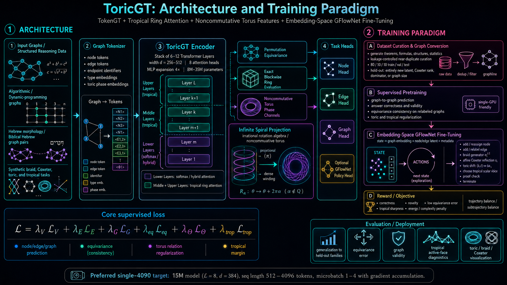
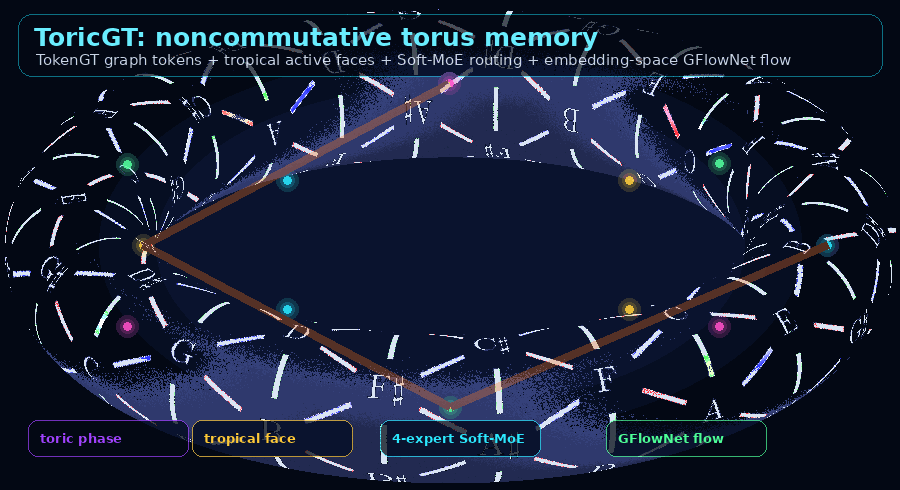
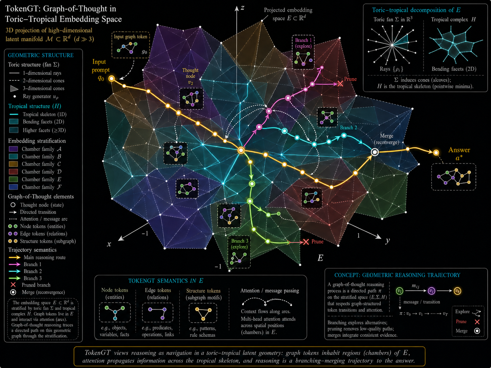

# ToricGT

Author: Amelie Schreiber

**Note:** *Tropical varieties should be embedded into toric varieties, thus ToricGT and TropicalGT become a single project*

The guiding convention is that tropical geometry is not a separate modeling layer bolted onto ToricGT, but the polyhedral and max-plus shadow of the same toric objects.  Tropical varieties naturally live inside toric varieties through their fans, cones, Newton polytopes, initial degenerations, and orbit stratifications; in the model this means tropical attention, active-face diagnostics, and max-plus reasoning should be treated as the computational chart language for the broader toric architecture.  Accordingly, ToricGT subsumes TropicalGT: the tropical components provide the piecewise-linear reasoning substrate, while the toric framework supplies the ambient algebraic geometry, compactification, and category-theoretic supervision.

ToricGT is a research prototype for TokenGT-style graph-to-graph modeling with tropical ring attention, default 4-expert Soft-MoE feed-forward blocks, finite noncommutative-torus features, Slepian/Pollak prolate concentration probes, combinatorial commutative-algebra certificates, and embedding-space GFlowNet fine-tuning.







<p align="center">
  <a href="./assets/toricgt_paper_pg_softmoe_final.tex"></a>
  <a href="https://github.com/amelie-iska/ToricGT/"></a>
  <a href="https://huggingface.co/blog/AmelieSchreiber/toricgt"></a>
</p>

*Note: consider PH disambiguation along decision boundaries or of words with multiple meanings*

**TokenGT base model**

```bash
tmux new-session -d -s toricgt_oai_toricgt_full_clone 'cd /home/iska/Documents/amelie/bio/ToricGT && RUN_NAME=toricgt_oai_toricgt_finewebval_metricfix_max16mb_d320l7_b16ga4_clone_$(date -u +%Y%m%dT%H%M%SZ) && WANDB_PROJECT=toricgt WANDB_RUN_NAME=$RUN_NAME PYTHONPATH=src /home/iska/miniconda3/envs/tokengt/bin/python scripts/train.py --config config/train.full_tokengt_got_fineweb_derived.yaml --checkpoint-dir checkpoints/$RUN_NAME 2>&1 | tee logs/full_tokengt_got_fineweb_derived/$RUN_NAME/train.log'
```

The native TokenGT FineWeb route is now autoregressive when
`use_causal_graph_attention` and `use_lm_token_embeddings` are enabled.  FineWeb
token chains receive their ordinary left-to-right reveal ranks; directed
acyclic reasoning graphs receive topological ranks; and cyclic, undirected, or
otherwise non-causal graphs receive deterministic content-independent random
reveal ranks.  Attention masks then allow a query graph token to see only graph
tokens whose reveal rank is no larger than its own.  This prevents the old
failure mode where the graph LM head predicted next SP1024 tokens while the
TokenGT encoder still had full bidirectional access to future nodes.

Route (1) also ports the compact OAI/Parameter-Golf baseline optimizations that
fit the TokenGT abstraction.  The next-run config ties the SP1024 LM head to
the learned token embedding, applies recurrent block passes for extra compute
without extra stored weights, adds target-position embeddings and toric
position phases, uses strict-prefix hash-context embeddings, adds a compact
revealed-neighbor hash over graph-adjacent nodes whose reveal rank is strictly
earlier than the query rank, injects SentencePiece operator/class features from
the already revealed input token, and applies a small SmearGate-style logit
temperature.  The old dense
`1024 x 1024` bigram-bias table is disabled in this route because the hash
context gives a more artifact-efficient version of the same competition trick.
These features remain score-valid: they depend only on public positions,
reveal/topological/random ranks, graph structure, and already revealed input
tokens.

**Inference geometry CLI**

TokenGT checkpoints can now be run with an optional geometry sidecar that emits
the same plot-family union used by periodic checkpoint analyses.  The default
command writes TokenGT-native trajectory plots, the R97-style rich geometry
bundle, interactive HTML for every 3D/4D family, symbolic CCA/resolution
certificates, triangle/tetrahedron diagnostics, and an `inference_output.json`
manifest:

```bash
PYTHONPATH=src /home/iska/miniconda3/envs/tokengt/bin/python scripts/infer_tokengt_with_geometry.py \
  --checkpoint checkpoints/<run>/toricgt_step_00001500.pt \
  --config config/train.full_tokengt_got_fineweb_derived.yaml \
  --output-dir outputs/tokengt_inference/<run>/step-00001500 \
  --records 1 \
  --batch-size 1 \
  --device cuda \
  --precision bf16
```

For a lightweight model run without figures, add `--no-emit-geometry`.  For
only the newer TokenGT-native plots without the R97 compatibility bundle, add
`--no-rich-legacy-geometry`.  To direct the figure bundle elsewhere, use
`--geometry-output-dir <path>`.

**Local analysis fixtures**

When the full curated shards are unavailable, generate a small deterministic
analysis fixture that exercises the same loaders and sidecars used by the
periodic training audits.  The fixture writes a six-record Parquet/JSONL graph
bundle plus point-cloud JSON for exact GUDHI/Macaulay2 persistence checks:

```bash
PYTHONPATH=src /home/iska/miniconda3/envs/tokengt/bin/python scripts/create_analysis_fixture_data.py \
  --output-dir data/analysis_fixtures
```

Run the exact topological/algebraic audit on the fixture point clouds:

```bash
PYTHONPATH=src /home/iska/miniconda3/envs/tokengt/bin/python scripts/run_gudhi_persistence_audit.py \
  --points-json data/analysis_fixtures/toricgt_analysis_points.json \
  --output-dir outputs/analysis_fixture_gudhi_points \
  --records 3 \
  --max-points 18 \
  --num-radii 4 \
  --num-levels 4
```

Run TokenGT inference plus geometry and GUDHI sidecars against the fixture:

```bash
PYTHONPATH=src /home/iska/miniconda3/envs/tokengt/bin/python scripts/infer_tokengt_with_geometry.py \
  --checkpoint checkpoints/<run>/toricgt_step_00023250.pt \
  --config config/train.full_tokengt_got_fineweb_derived.yaml \
  --data-glob data/analysis_fixtures/toricgt_analysis_fixture.parquet \
  --output-dir outputs/analysis_fixture_tokengt_inference \
  --records 2 \
  --batch-size 1 \
  --device cpu \
  --precision fp32 \
  --emit-gudhi-persistence
```

The fixture records cover toric/tropical active-face reasoning,
GUDHI-driven two-parameter persistence, Toric BGG category-O certificates,
Hebrew root-template graphs, noncommutative torus phase memory, and
Parameter-Golf BPB causality controls.

Rendered screenshot audits of the fixture HTML reports are written under
`outputs/latest_rendered_html_screenshots` when Playwright capture is run.  The
current review and implementation plan for the generated pages is tracked in
`planning/RENDERED-HTML-AUDIT-AND-IMPLEMENTATION-PLAN-20260614.md`.

**OpenAI competition baseline model**

```bash
tmux new-session -d -s toricgt_oai_byte_tokengt_hybrid 'cd /home/iska/Documents/amelie/bio/ToricGT && RUN_NAME=toricgt_oai_byte_tokengt_hybrid_$(date -u +%Y%m%dT%H%M%SZ) && mkdir -p logs/parameter_golf_random_order_hybrid_tokengt/$RUN_NAME checkpoints/$RUN_NAME && WANDB_PROJECT=toricgt-parameter-golf WANDB_RUN_NAME=$RUN_NAME PYTHONPATH=src /home/iska/miniconda3/envs/tokengt/bin/python scripts/train_parameter_golf_random_order.py --config config/train.parameter_golf_random_order_hybrid_tokengt.yaml --checkpoint-dir checkpoints/$RUN_NAME 2>&1 | tee logs/parameter_golf_random_order_hybrid_tokengt/$RUN_NAME/train.log'
```

## Model Overview

The animation above is not just decoration.  It is the visual intuition for the
model's core geometry: a reasoning trajectory moves through an ambient
toric/tropical embedding space, wraps around finite noncommutative-torus phase
coordinates, branches and merges as a graph-of-thought, and is periodically
pulled back into well-behaved chambers by algebraic and topological
certificates.

The Slepian/Pollak or prolate-spheroidal part of ToricGT is similar to the GIF
because both describe concentrated waves moving on a constrained phase space.
In the classical continuous setting, prolate spheroidal wave functions solve a
time-band concentration problem:

```math
\int_{-T}^{T}\frac{\sin W(t-s)}{\pi(t-s)}\psi_n(s)\,ds
=\lambda_n\psi_n(t).
```

In the discrete model, ToricGT uses finite DPSS/Slepian-style concentration
probes on projected toric phase leaves.  If hidden states trace a phase curve
`z_t=(exp(2*pi*i*theta_t), exp(2*pi*i*beta_t))`, the Slepian loss asks useful
reasoning energy to remain concentrated in a stable band, chamber, or corridor:

```math
\mathcal L_{\mathrm{Slepian}}
=
1-\frac{\sum_{k\in B}|\widehat z_k|^2}
        {\sum_{k}|\widehat z_k|^2+\epsilon}.
```

That matters for compression and reasoning because a small model must reuse
stable coordinates.  Prolate concentration discourages noisy wandering in phase
space; tropical attention selects active faces; GraphCG disentangles concept
axes; and the graph-of-thought GFlowNet searches over branching reasoning
trajectories that have good likelihood, memory support, and algebraic
certificates.

The main advanced loss families are deliberately small auxiliary terms around
the likelihood/BPB objective:

```math
\mathcal L
=
\mathcal L_{\mathrm{LM}}
+\lambda_{\mathrm{GFN}}\mathcal L_{\mathrm{TB}}
+\lambda_{\mathrm{DAG}}\mathcal L_{\mathrm{GoT}}
+\lambda_{\mathrm{mem}}\mathcal L_{\mathrm{memory}}
+\lambda_{\mathrm{GraphCG}}\mathcal L_{\mathrm{disentangle}}
+\lambda_{\mathrm{toric}}\mathcal L_{\mathrm{toric}}
+\lambda_{\mathrm{trop}}\mathcal L_{\mathrm{tropical}}
+\lambda_{\mathrm{top}}\mathcal L_{\mathrm{PH}}
+\lambda_{\mathrm{CCA}}\mathcal L_{\mathrm{res}}
+\lambda_{\mathrm{der}}\mathcal L_{\mathrm{derived}}.
```

For the official-byte hybrid path, the TokenGT-style term is a real optimizer
objective rather than a passive diagnostic:

```math
\mathcal L_{\mathrm{TokenGT}}
=a_e\,\mathrm{BCE}(\langle h_i,h_j\rangle/\tau,E_{ij})
+a_d\,\mathbb E_{i\to j}\big[\max(0,m-\cos(h_j-h_i,\phi(p_j)-\phi(p_i)))^2\big]
+a_p\,\mathrm{SmoothL1}(d_h(i,j),\log(1+|p_i-p_j|))
+a_c\,\mathrm{BCE}(\langle h_i,h_j\rangle/\tau,C_{ij})
+a_{\circlearrowleft}\,\mathbb E_{\mathrm{back}}\sigma(\langle h_i,h_j\rangle/\tau).
```

Here `h_i` is the hidden state for reveal vertex `i`, `p_i` is its byte
position, `E_ij` is the local graph edge label, `C_ij` is a coarse byte-class
agreement label, and `phi` is the toric phase feature map.  The direction and
cycle terms are active only for graphs with a meaningful causal orientation.

- `BPB / LM`: the primary objective is byte-level negative log likelihood,
  `BPB = loss / log(2)` when the scored units are bytes.
  TokenGT graph-node FineWeb metrics are reported separately as SP1024
  bits/token plus a decoded-byte estimated BPB proxy; only the byte-level
  evaluator writes official OpenAI Parameter-Golf BPB.
- `Hybrid byte TokenGT`: the official byte model can now receive TokenGT-style
  graph supervision without changing the scored byte logits.  Each FineWeb byte
  chunk is treated as a graph whose vertices are random-order reveal steps and
  whose local sequential edges are directed when reveal/order causality is
  meaningful.  Cyclic or noncausal graph sources use the same objective as an
  undirected structural regularizer rather than forcing an artificial causal
  orientation.
- `GFlowNet trajectory balance`: for a sampled graph-of-thought trajectory
  `tau`, `L_TB = (log Z + sum log P_F - log R(tau) - sum log P_B)^2`.
- `GraphCG disentanglement`: learned basis vectors should align with reusable
  concept axes while minimizing cross-axis leakage and superposition.
- `Toric/tropical`: active-face, binomial, chamber, braid/Coxeter, and phase
  residuals make hidden trajectories reusable across toric charts.
- `Slepian/Pollak`: DPSS/prolate concentration keeps phase trajectories
  band-limited inside useful reasoning corridors.
- `Topology / persistence`: filtered complexes built from hidden trajectories
  track connected components, cycles, directed asymmetry, persistence morphisms,
  and simplex-density changes.
- `CCA / resolutions`: Stanley-Reisner ideals, toric ideals, Koszul/BGG
  complexes, Fitting ideals, Buchsbaum-Eisenbud rank tests, and multigraded
  Betti tables audit whether a reasoning step behaves like a coherent finite
  complex.
- `Derived comparison`: chain maps and mapping cones compare reasoning
  complexes up to quasi-isomorphism, so memory retrieval and analogy can match
  algebraic structure rather than only endpoint embeddings.

The Parameter-Golf rule is conservative: the 16 MB artifact should keep only
what improves the restricted FineWeb validation BPB or can be distilled into
the compact byte model.  Larger certificates, exact resolutions, diagrams, and
derived-category objects are training and analysis tools unless ablations show
that exporting a compact probe improves the competition score.

Current validated status:

- Branch: active work is on `oai-toricgt` in this repo. Credentials, local
  `keys.txt`, W&B tokens, and checkpoints are intentionally not committed.
- CPU tests: focused Parameter-Golf structural-token/model/recovery tests pass:
  `PYTHONPATH=src python -m pytest tests/test_seq4096_4k_recovery_gate.py tests/test_seq4096_analysis.py tests/test_seq4096_bigram_bias.py tests/test_parameter_golf_advanced_tokens.py tests/test_parameter_golf_export.py -q`
  (`36 passed`, with only existing SWIG deprecation warnings).
- CPU implementation validation: default Soft-MoE, tropical-ring attention, embedding-space GFlowNet trajectory balance, and finite rotation-algebra checks run without meaningful VRAM use.
- CUDA capacity validation: `d=384`, 8 layers, 8 heads, 29.8M parameters, 1,280 graph tokens, bf16, default Soft-MoE, and embedding-space GFlowNet loss completed one optimizer step at about 6.0GB peak VRAM for batch 1 and 11.9GB for batch 2.
- Parameter-Golf dense random-order scaffold: the default 13.0M-parameter byte model exports as a 12.94MB int8 compressed artifact, below the 16,000,000 byte cap, with compact embedding-space GFlowNet action sampling enabled.
- OpenAI Parameter-Golf BPB path: the preserved public checkpoints are now the
  4K low-BPB checkpoint and its 20K continuation, followed by a new advanced
  step-0 run that keeps PolarQuant and combinatorial CCA/DG/topology metrics
  active from the beginning.  The R52/R60/R78 recovery notes below are
  historical controller evidence, not the current live run.
- Published Parameter-Golf checkpoint metrics, with train and validation
  quantities paired by type:

  | checkpoint | step | train loss | val loss | train BPB | val BPB | raw `.pt` bytes | compact artifact bytes | counted bytes | under 16 MB |
  |---|---:|---:|---:|---:|---:|---:|---:|---:|---:|
  | `parameter_golf_oai_4k_bpb1p20848.pt` | 4,000 | 2.0280 | 2.0405 | 1.1959 | 1.2084838045 | 141,911,419 | 15,786,767 | 15,901,889 | yes |
  | `parameter_golf_oai_20k_bpb1p16858.pt` | 20,000 | 1.9289 | 1.9731 | 1.1332 | 1.1685778760 | 141,928,171 | 15,779,613 | 15,894,735 | yes |
  | `parameter_golf_oai_best.pt` | 20,000 | 1.9289 | 1.9731 | 1.1332 | 1.1685778760 | 141,928,171 | 15,779,613 | 15,894,735 | yes |

  The raw `.pt` checkpoints are resume/analysis checkpoints and exceed the
  competition artifact cap.  The compact `.ptz` artifacts are the
  size-constrained exports; the counted 4K and 20K artifacts remain below the
  16,000,000 byte Parameter-Golf limit.
- Current active advanced run:
  `toricgt_oai_toricgt_finewebval_b8ga8_20260607T143904Z`, W&B
  <https://wandb.ai/amelie-iska-math/toricgt/runs/ml223ywe>.  It starts from
  step 0 on the full graph-structured dataset plus restricted FineWeb OAI
  Parameter-Golf validation, with tropical-ring attention, graph-of-thought
  DAG/memory losses, embedding-space GFlowNets, derived-category/CCA examples,
  and medium-conservative advanced metrics active.  It was restarted after the
  previous run used only about 3.6 GB of RTX 4090 VRAM; the live config now uses
  `batch_size=8` and `grad_accum_steps=8`, preserving an effective batch of 64
  examples per optimizer step while raising CUDA memory use to roughly 14 GB in
  the launch smoke test.
- The step-0 NaN failure mode from
  `toricgt_advdg_step0_polar_seq4096_20260605T214439Z` is treated as an
  optimizer/gradient guard problem, not a reason to remove CCA/DG/topology.
  The repaired run keeps advanced losses enabled, ramps PolarQuant, logs
  nonfinite-update guards, and skips poisoned optimizer updates before they can
  corrupt weights or optimizer state.
- Seq4096 recovery automation now uses metric-driven launch controls. Repeated
  validation ETA misses trigger pre-gate recovery; projected-miss cases use
  batch/LR controls, while train-low / validation-lag cases lower LR and keep
  the competition BPB runner clean. GraphCG, Slepian/Pollak, topology, toric,
  BGG Category O, Koszul, tropical, complexity, and persistent-homology signals
  are used as sidecar transfer and decision diagnostics until the <1.2 BPB
  competition checkpoint is preserved. At the tied-LR cap, the watcher switches
  to zero-initialized bigram transition-bias recapture. If the bigram head is
  already enabled and diagnostics show high topology/toric/Slepian/BGG/
  complexity pressure, the watcher now uses a bounded structural recapture
  score and a guarded structural-pressure recovery: it stops escalating tied
  embedding LR, damps lexical/bigram controls to their floor, lengthens warmup,
  and keeps heavy structural losses out of the compact competition scorer.
  The controller revision `c845eda` breaks the structural score into
  family-level pressure groups (`bpb_gap`, `topology_directed`,
  `toric_slepian`, `bgg_koszul`, and `tropical_complexity`) so high structural
  pressure no longer implies a single action: guarded pressure with healthy
  transfer can allow a small BPB velocity nudge, while dominant toric/Slepian or
  directed-topology pressure favors warmup and LR damping if another restart is
  needed.
  Revision `8ece259` adds the gate-velocity requirement/shortfall metrics and a
  curvature-aware structural-relief velocity policy; revision `07f899d` makes
  preemptive gate restarts require a material projected overrun or real
  velocity-shortfall pressure instead of a bare projected step greater than
  `4000`.
  Recovery run ids are compacted to avoid W&B `CommError` failures from
  recursively long names.
- W&B mirrors now report `diagnostics/latest/structural_recapture_score`,
  `diagnostics/latest/structural_pressure_high`,
  `diagnostics/latest/structural_recapture_band_id`,
  train-to-validation transfer aliases such as
  `diagnostics/latest/transfer_efficiency_recent`, and
  `diagnostics/structural_recapture_components/*` in both history and summary.
  They also pin family-aware aliases including
  `diagnostics/latest/structural_family_pressure_bpb_gap`,
  `diagnostics/latest/structural_family_pressure_topology_directed`,
  `diagnostics/latest/structural_family_pressure_toric_slepian`,
  `diagnostics/latest/structural_family_pressure_bgg_koszul`,
  `diagnostics/latest/structural_family_pressure_tropical_complexity`,
  `diagnostics/latest/dominant_structural_pressure_id`, and
  `diagnostics/latest/dominant_structural_pressure_value`.
  Gate-aware aliases now include
  `diagnostics/latest/required_val_velocity_to_gate_per_100_steps`,
  `diagnostics/latest/val_bpb_velocity_recent_per_100_steps`,
  `diagnostics/latest/val_velocity_shortfall_to_gate_per_100_steps`, and
  `diagnostics/latest/bpb_velocity_shortfall_pressure`.
  The `oai-advanced` branch adds `src/toricgt/bpb_transfer_controller.py` and
  `bpb/bpb_transfer_controller_report.json` /
  `bpb/bpb_transfer_controller_map.png` outputs, which convert family-level
  metric evidence into explicit early-BPB loss-scale policy, artifact-size
  policy, and post-threshold phase recommendations.
  Periodic analyses also write `bpb/structural_recapture_report.json`,
  `bpb/bpb_structural_recapture_map.png`,
  `bpb/bpb_transfer_efficiency_report.json`, and
  `bpb/bpb_transfer_efficiency.png` beside the BPB rockfall dashboard, plus
  `bpb/advanced_metric_control_map.png` for the family-level velocity/damping/
  transfer-stabilization decision and `bpb/bpb_gate_velocity_requirement.png`
  for the 4K-gate BPB velocity shortfall readout.
- Advanced reasoning/memory branch: the live auxiliary run is
  `toricgt-graphcg-slepian-adaptive-step0-20260603T214528Z`.
  It trains the random-order ToricGT adapter with explicit graph-of-thought,
  reasoning-step, memory, and analogy tokens; GraphCG basis disentangling;
  trajectory-memory, analogy, topology, toric, BGG Category O, Koszul
  persistence, and Slepian/Pollak auxiliary diagnostics; and a bounded adaptive
  structural-loss multiplier.
- W&B is on by default for training configs that can use it. The local
  `keys.txt`/`.netrc` credential path is intentionally not committed or pushed.
- The full curation job writes leakage-controlled train/validation/test Parquet splits under `data/curated/`; validate it with `scripts/inspect_curated_data.py` before launching long training.

## What Is Here

Public upstream clones are under `amelie-iska/`:

- `amelie-iska/tokengt`: TokenGT baseline.
- `amelie-iska/ringattention`: official Ring Attention implementation linked from the paper.
- `amelie-iska/Tropical-Attention`: official Tropical Attention implementation.

Local implementation:

- `src/toricgt/toric_algebra.py`: clock/shift operators, finite torus approximants, braid and affine Coxeter helpers.
- `src/toricgt/tropical_attention.py`: softmax, tropical, and exact blockwise tropical-ring attention.
- `src/toricgt/soft_moe.py`: graph-token Soft-MoE, prefix-causal Soft-MoE, and routing diagnostics.
- `src/toricgt/graph_tokenizer.py`: node/edge TokenGT-style graph tokenization.
- `src/toricgt/model.py`: graph-to-graph ToricTokenGT encoder with default embedding-space GFlowNet policy head.
- `src/toricgt/gflownet.py`: embedding-space GFlowNet policy and trajectory-balance loss.
- `src/toricgt/graph_dataset.py`: Parquet/JSONL graph-record streaming into padded graph batches.
- `src/toricgt/synthetic.py`: synthetic rotation-algebra and tropical shortest-path curriculum records.
- `src/toricgt/polar_cache.py`: recursive polar encode/decode utilities for optional KV-cache compression experiments.
- `src/toricgt/parameter_golf_export.py`: byte accounting and compressed artifact export helpers.
- `src/toricgt/random_order_lm.py`: dense random-order autoregressive ToricGT adapter for the OpenAI Parameter Golf track, including compact prefix-visible GFlowNet action routing, advanced reasoning/memory special-token encoding, official-byte TokenGT-style causal graph supervision, GraphCG/analogy/topology hooks, Toric BGG/Koszul probes, and differentiable Slepian/Pollak trajectory-concentration losses.
- `src/toricgt/gudhi_persistence.py`: exact GUDHI simplex-tree persistence audits, vectorized PH metrics, explicit `F2[x_level,y_radius]` reasoning/radius module maps, Macaulay2 bigraded chain-complex scripts, homology modules, free resolutions, and Betti-table extraction.
- `src/toricgt/toric_geometry_tasks.py`: training-only low-rank toric probes for Newton active-face, bend, binomial, affine-Coxeter, braid, and phase-foliation signals.
- `src/toricgt/toric_vector_bundles.py`: training-only Klyachko vector-bundle and equivariant-sheaf probes over the tropical-to-toric embedding fan, with exact finite filtration nesting, chart-transition cocycle checks, cone-splitting regularizers, and Cech-style gluing metrics.
- `src/toricgt/cas_certificates.py`, `src/toricgt/cas_oracles.py`, and `src/toricgt/cas_backed_losses.py`: exact certificate schemas/cache, strict SageMath/Macaulay2 discovery and oracle wrappers, closed-form finite Stanley-Reisner certificates, and differentiable losses that consume exact CAS/closed-form targets without inventing algebraic facts in Torch.
- `src/toricgt/slepian_torus.py`: finite Slepian/DPSS phase-concentration probes for projected noncommutative torus leaves used by the geometry audit suite.
- `src/toricgt/music.py`: dark analog-synth algorithmic music from torus orbits, tropical active faces, Slepian envelopes, and Soft-MoE-style routing.
- `src/toricgt/datasets.py`: dataset manifest and leakage-controlled splitting.
- `scripts/`: curation, training, evaluation, visualization, publication, and validation entrypoints.
- `assets/toricgt_torus_reasoning_dark.gif`: README animation for toric phase, tropical active-face, Soft-MoE, and GFlowNet flow intuition.
- `assets/toricgt_paper_pg_softmoe_final.tex`: research paper source.
- `assets/toricgt_paper_pg_softmoe_final.pdf`: compiled paper.
- `planning/IMPLEMENTATION-PLAN.md`: detailed implementation plan.
- `planning/DATA.md`: dataset research, curation, and segmentation plan.
- `planning/SEQUENTIAL-FINEWEB-PIVOT.md`: current Parameter-Golf BPB pivot record and launch policy for the sequential FineWeb-first branch.
- `planning/TROPICAL-TORIC-CAS-IMPLEMENTATION.md`: CAS-backed plan for embedding tropical attention/fan diagnostics into toric varieties and using SageMath/Macaulay2 certificates for exact algebraic metrics, losses, and audits.
- `planning/GUDHI-M2-TWO-PARAMETER-PERSISTENCE.md`: exact GUDHI plus Macaulay2 plan for 2-parameter reasoning/radius persistence modules over `F2[x_level,y_radius]`, including simplex maps, vectorized PH metrics, free resolutions, HTML reports, and periodic/inference integration.
- `planning/TORIC-VECTOR-BUNDLES-SHEAVES-TRAINING.md`: research and implementation plan for Klyachko toric vector bundles, equivariant sheaves, Cech gluing, and their training use once tropical varieties are embedded into toric varieties.
- `docs/PARAMETER_GOLF.md`: dense random-order Parameter-Golf adaptation notes.
- `docs/HYBRID_BYTE_TOKENGT_BPB.md`: official byte-BPB plus TokenGT-style internal graph objective notes and pseudocode.

CAS-backed exact certificate entrypoints:

```bash
scripts/install_cas_backends.sh

python scripts/build_toric_tropical_certificates.py \
  --output-dir outputs/cas_certificates \
  --num-vertices 6 \
  --all-exact-cas \
  --require-cas

python scripts/validate_cas_certificates.py outputs/cas_certificates/cache

python scripts/run_periodic_cas_audit.py \
  --output-dir outputs/periodic_cas_audit \
  --all-exact-cas \
  --require-cas
```

The closed-form cyclic Stanley-Reisner certificate is exact and always
available. The full exact audit currently builds five certificates: the
closed-form Stanley-Reisner certificate, a SageMath Newton-polytope normal-fan
certificate, a Macaulay2 smoke certificate, and a Macaulay2 elimination
certificate for a nontrivial toric ideal whose exact binomial rows feed the
CAS-backed toric relation loss, plus a Macaulay2 `ToricVectorBundles`
certificate for a rank-2 Klyachko vector bundle on `P^2`. Missing backends are
reported as unavailable and are never replaced by Torch surrogate metrics.
Run `scripts/install_cas_backends.sh` on a ToricGT workstation before enabling
exact CAS-required metrics. The script installs SageMath for the `tokengt`
workflow, installs Macaulay2 through Ubuntu apt when needed, installs/checks
supporting toric and tropical tools (`gfan`, `Singular`, Normaliz/PyNormaliz,
4ti2, LattE integrale, lrslib, nauty, TOPCOM, and polymake when available),
checks/installs the Python GUDHI and Plotly packages needed for exact
persistent-homology HTML audits, and runs the required Sage/Macaulay2 ToricGT
certificate verification.
Macaulay2's `ToricVectorBundles` package is also checked by the discovery
code.  When available, `--all-exact-cas` constructs a real Klyachko vector
bundle certificate and records `isVectorBundle`, chart count, Euler
characteristic, filtration data, and basis data.  The train-time
vector-bundle/sheaf probe still uses bounded finite Klyachko/Cech certificates
for GPU losses, while CAS audits provide exact external verification targets.
Periodic checkpoint analysis can include the same check with
`scripts/watch_training_analysis.py --cas-audit --cas-audit-all-exact-cas
--cas-audit-require-cas`; the generated `SYNOPSIS.md` then records
Sage/Macaulay2 availability, exact-certificate build status, and the exact
command-line toric toolchain status. The supervised all-phases launcher passes
these audit flags automatically.

GUDHI/Macaulay2 two-parameter persistence audits are also wired into periodic
analysis.  The all-phases config sets `analysis.periodic_interval_steps: 250`
and enables `analysis.gudhi_persistence`, so the supervisor calls
`scripts/watch_training_analysis.py --gudhi-persistence-audit` every 250
checkpoint steps by default.  Each audit samples checkpoint tensors or
inference point clouds, builds exact GUDHI Rips simplex trees, computes
landscapes, persistence images, silhouettes, entropy vectors, and exact
`F2[x_level,y_radius]` structure maps for reasoning level and embedding-space
radius.  Macaulay2 then receives the homogeneous bigraded chain complex over
`GF(2)[x_level,y_radius]` and emits `HH_i`, presentations, free resolutions,
and Betti tables.  The output lives at
`outputs/post_resume_analysis/<run>/step-*/gudhi_persistence/index.html`, with
per-record pages and the exact `.m2` scripts under `records/` and
`macaulay2/`.  The parent analysis directory also writes a dark-mode
`index.html` linking the GUDHI/M2 audit to CAS, topology, OAI BPB,
derived-category, memory, and test-time-scaling reports when available.

Run the exact audit manually on a checkpoint with:

```bash
conda run --no-capture-output -n tokengt env PYTHONPATH=src \
  python scripts/run_gudhi_persistence_audit.py \
  --checkpoint outputs/trainer_smoke_vector_bundle/random_order_step_00000001.pt \
  --output-dir outputs/gudhi_old_checkpoint_audit \
  --records 1 \
  --max-points 8 \
  --num-radii 3 \
  --num-levels 3 \
  --macaulay2-timeout-seconds 60
```

The same report is optional at inference time:

```bash
conda run --no-capture-output -n tokengt env PYTHONPATH=src \
  python scripts/infer_tokengt_with_geometry.py \
  --checkpoint <checkpoint.pt> \
  --output-dir outputs/inference_with_gudhi \
  --emit-gudhi-persistence
```

The training objective does not differentiate through GUDHI.  Train-time
regularization uses differentiable landscape/image vectorizers on small
diagram-like 0D tensors, and W&B logs `train/analogy_step_ph_landscape_loss`,
`train/analogy_step_ph_landscape_norm`, `train/analogy_step_ph_image_energy`,
`topology/ph_landscape_loss`, `topology/ph_landscape_norm`, and
`topology/ph_image_energy`.  Exact GUDHI and Macaulay2 values remain CPU
analysis artifacts and are never replaced by silent Torch fallbacks.

## Setup

Use Conda only. The working environment used for this repository is `tokengt`.

```bash
conda create -n tokengt python=3.11 -y
conda activate tokengt
python -m pip install -e .
```

If the machine already has a managed PyTorch installation in the Conda environment, install the remaining packages first and then install this package with `--no-deps`.

```bash
python -m pip install -e . --no-deps
```

## Credentials

Do not paste API tokens into shell history, notebooks, docs, or issue comments.

Configure services locally:

```bash
gh auth login
hf auth login
wandb login
```

Authenticated forking and Hugging Face pushes are intentionally not hard-coded in this repo.

## Dataset Curation

The full data research and segmentation plan is in [planning/DATA.md](/home/iska/Documents/amelie/bio/ToricGT/planning/DATA.md). The selected corpus includes:

- `AI-MO/NuminaMath-CoT`
- `open-r1/OpenR1-Math-220k`
- `open-r1/codeforces-cots`
- `openai/gsm8k`
- `openai/frontierscience` (eval-only)
- `openai/healthbench` (eval-only)
- `openai/healthbench-professional` (eval-only)
- `openai/graphwalks` (test-time scaling)
- `EleutherAI/hendrycks_math`
- `HuggingFaceH4/MATH-500`
- `terrycraddock/Tree_Of_Thoughts_BASE_24k`
- `gss1147/Got_Math_500K`
- `unimorph/universal_morphologies`
- `Sefaria/Rabbinic-Hebrew-English-Pairs`
- `Sefaria/hebrew_library`
- `Alibaba-Apsara/Superior-Reasoning-SFT-gpt-oss-120b`
- `Jackrong/GPT-OSS-120B-Distilled-Reasoning-math`
- `reasoning-degeneration-dev/algorithmic-sft-training-data-v1`
- `lamm-mit/graph-reasoning-messages-11K`
- `sequelbox/DAG-Reasoning-DeepSeek-R1-0528`
- `Gryphe/Opus-4.6-Reasoning-24k`
- `nvidia/Nemotron-RL-ReasoningGym-v1`
- `nvidia/Nemotron-Content-Safety-Reasoning-Dataset`
- `nvidia/PhysicalAI-Traffic-Anomaly-Reasoning`

The Hebrew/Jewish-text slice intentionally uses Sefaria and UniMorph Hebrew sources, and excludes Christian-branded biblical-language datasets.

The frontier-reasoning slice prioritizes open or permissively licensed public traces, especially gpt-oss-120b text distillations. Logprob-only gpt-oss sidecar data is reserved for optional reward/GFlowNet work after tokenizer alignment.

The NVIDIA/Nemotron slice adds procedurally verifiable reasoning, safety-label justification traces, and physical/temporal scene reasoning. These newly added sources are forced into the ToricGT `test` split for held-out test-time scaling. Larger NVIDIA PhysicalAI spatial and PhysicsNeMo CFD datasets are documented in `planning/CYCLIC-EXPERT-GFLOWNET-PLAN.md` as opt-in graph-adapter sources rather than default text curation.

Additional OpenAI benchmark and graph-reasoning notes, plus the proposed
SauravMaheshkar higher-order simplicial augmentation plan, are in
[planning/DATA-II.md](/home/iska/Documents/amelie/bio/ToricGT/planning/DATA-II.md).

Create a bounded sample curation:

```bash
conda run -n tokengt env PYTHONPATH=src python scripts/curate_datasets.py \
  --output-dir data/curated_sample \
  --raw-dir data/raw/hf \
  --max-records-per-source 1000 \
  --num-workers 4 \
  --normalize-batch-size 128
```

Run full curation and leakage-controlled 80/10/10 segmentation:

```bash
conda run -n tokengt env PYTHONPATH=src python scripts/curate_datasets.py \
  --output-dir data/curated \
  --raw-dir data/raw/hf \
  --chunk-size 20000 \
  --num-workers 16 \
  --normalize-batch-size 256
```

Inspect curated outputs:

```bash
conda run -n tokengt env PYTHONPATH=src python scripts/inspect_curated_data.py \
  --curated-dir data/curated \
  --with-token-counts
```

Annotate Hebrew rows for niqqud coverage before public upload or training:

```bash
conda run -n tokengt env PYTHONPATH=src python scripts/enrich_hebrew_niqqud.py \
  --curated-dir data/curated \
  --in-place \
  --batch-size 32768
```

Then write the coverage audit:

```bash
conda run -n tokengt env PYTHONPATH=src python scripts/report_hebrew_niqqud.py \
  --curated-dir data/curated
```

This preserves existing niqqud and marks Hebrew rows with `has_niqqud`, `has_hebrew_without_niqqud`, and related counts in `quality_flags_json`. It does not fabricate vowels for unpointed Hebrew; use `--drop-unpointed-hebrew` only for a strict pointed-Hebrew subset. Add `--update-metadata` only when you explicitly need the same niqqud payload embedded into `metadata_json`; that is slower for large Sefaria rows. Current audit: `3,564,756` rows contain Hebrew, `2,868` are pointed from upstream source text, and `3,561,888` are unpointed upstream rows that are explicitly flagged for filtering or later vetted restoration.

The current full curation contains `5,790,736` records and about `14.52B` estimated whitespace tokens. The split is `4,633,582 / 578,319 / 578,835` rows for train/validation/test. The repaired GoT Math shard contributes `518,439` graph-of-thought records, and Hebrew rows carry niqqud coverage flags.

The public curated split repository is `AmelieSchreiber/toricgt-curated-splits`.
It currently contains the dataset card, manifest, split reports, niqqud audit,
and architecture image. The full local Parquet splits are large
(`train.parquet` is about 40GB; validation and test are about 5.1GB each), so
publish or resume them with `hf upload-large-folder` before expecting the
download command below to fetch Parquet files. The dataset repo is listed with
the checkpoint repo in the ToricGT collection:
<https://huggingface.co/collections/AmelieSchreiber/toricgt>.
After the Parquet files are present on the Hub, download the splits with the
current Hugging Face CLI:

```bash
HF_HUB_ENABLE_HF_TRANSFER=1 \
conda run --no-capture-output -n tokengt hf download \
  AmelieSchreiber/toricgt-curated-splits \
  --repo-type dataset \
  --local-dir data/curated \
  --max-workers 8 \
  --include "README.md" \
  --include "train.parquet" \
  --include "validation.parquet" \
  --include "test.parquet" \
  --include "manifest.json" \
  --include "split_report.json" \
  --include "split_report.md" \
  --include "niqqud_report.json"
```

Publish split Parquet files to a public Hugging Face dataset repo using the local credential store. For large uploads, prefer the resumable CLI path:

```bash
HF_HUB_ENABLE_HF_TRANSFER=1 HF_XET_HIGH_PERFORMANCE=1 \
conda run --no-capture-output -n tokengt hf upload-large-folder \
  AmelieSchreiber/toricgt-curated-splits \
  data/curated \
  --type dataset \
  --no-private \
  --num-workers 8 \
  --include "README.md" \
  --include "train.parquet" \
  --include "validation.parquet" \
  --include "test.parquet" \
  --include "manifest.json" \
  --include "split_report.json" \
  --include "split_report.md" \
  --include "niqqud_report.json"
```

The Python helper performs the same logical upload for smaller runs:

```bash
conda run -n tokengt env PYTHONPATH=src python scripts/publish_hf_dataset.py \
  --curated-dir data/curated \
  --repo-id AmelieSchreiber/toricgt-curated-splits \
  --public
```

The splitter uses task-family keys, exact content hashes, and SimHash prefixes before assigning train/validation/test to reduce leakage. The target split is 80/10/10. Outputs are Parquet files under `data/curated/`, with per-dataset shards under `data/curated/by_dataset/`.

Publish a checkpoint to the public Hugging Face model repo:

```bash
conda run -n tokengt env PYTHONPATH=src python scripts/publish_hf_model.py \
  --checkpoint checkpoints/<run>/toricgt_final.pt \
  --repo-id AmelieSchreiber/toricgt-checkpoints
```

The `oai` Parameter Golf trainer also has automatic best-checkpoint publishing
enabled in `config/train.parameter_golf_random_order_dense.yaml`. At each
validation improvement, it saves `checkpoints/parameter_golf_oai_dense/best.pt`
and uploads that file to `AmelieSchreiber/toricgt-checkpoints` as
`parameter_golf_oai_best.pt` only when the composite promotion score improves:

```text
publish_score = val_bpb + 0.05 * complexity/val/prediction_target_ncd_lzma_mean
```

The matching manifest is `parameter_golf_oai_best.json`. Worse checkpoints are
skipped, so the HF repo remains the current best candidate rather than a dump
of every interval. Auth comes from the normal Hugging Face credential store or
the local ignored `keys.txt`; tokens are never printed, logged, or stored in
checkpoints. Publish failures are reported as `hf_publish/error` in W&B and do
not stop training.

Local periodic training checkpoints are retained every 250 steps by default
under `checkpoints/parameter_golf_oai_dense/`; they are not pruned, so earlier
resume points remain available for ablations and recovery.

For large checkpoint files, git-lfs is more reliable than the HTTP helper:

```bash
git lfs install
git clone https://huggingface.co/AmelieSchreiber/toricgt-checkpoints /tmp/toricgt-checkpoints
cp checkpoints/<run>/toricgt_final.pt /tmp/toricgt-checkpoints/
cd /tmp/toricgt-checkpoints
git add .
git commit -m "Upload ToricGT checkpoint"
git push origin main
```

## Implementation Validation

CPU-only validation:

```bash
conda run -n tokengt env PYTHONPATH=src python scripts/validate_cpu.py
```

This checks model shapes, default Soft-MoE routing, tropical-ring attention, embedding-space GFlowNet trajectory balance, and finite rotation-algebra commutator consistency without using meaningful GPU memory.

## Training

Generate local synthetic curriculum records:

```bash
conda run -n tokengt env PYTHONPATH=src python scripts/generate_synthetic_data.py \
  --output data/synthetic/toricgt_synthetic.jsonl \
  --count 10000 \
  --seed 17
```

Small synthetic training run:

```bash
conda run -n tokengt env PYTHONPATH=src python scripts/train.py --steps 100 --attention tropical_ring --device cpu
```

One-step CUDA capacity check for the primary 30M-class model:

```bash
conda run -n tokengt env PYTHONPATH=src python scripts/validate_cuda_capacity.py \
  --device cuda \
  --attention hybrid \
  --d-model 384 \
  --num-heads 8 \
  --num-layers 8 \
  --max-nodes 256 \
  --max-edges 1024 \
  --batch-size 1 \
  --precision bf16 \
  --gflownet-loss-weight 0.01
```

Soft-MoE is enabled by default in the upper half of the encoder with four experts and two slots per expert. Use `--no-soft-moe` for dense feed-forward ablations, or `--soft-moe-all-layers` for the heavier all-layer setting.

Curated Parquet training run:

```bash
conda run -n tokengt env PYTHONPATH=src python scripts/train.py \
  --data-path data/curated/train.parquet \
  --steps 1000 \
  --attention hybrid \
  --device cuda \
  --d-model 256 \
  --num-heads 8 \
  --num-layers 6 \
  --max-nodes 256 \
  --max-edges 1024 \
  --batch-size 1 \
  --grad-accum-steps 8 \
  --precision bf16 \
  --lr-schedule cosine \
  --warmup-steps 2000 \
  --gflownet-loss-weight 0.01 \
  --gflownet-space embedding \
  --val-data-path data/curated/validation.parquet \
  --eval-every 1000 \
  --eval-batches 20 \
  --checkpoint-every 1000 \
  --wandb
```

Resume from a checkpoint by adding:

```bash
--resume checkpoints/<run>/toricgt_step_00001000.pt
```

When `--wandb` is enabled, the trainer reports online metrics with an explicit
`trainer/step` alias. Core graph-model runs report train loss, supervised
loss, GFlowNet trajectory-balance loss, GFlowNet loss weight, graph tokens per
microbatch, LR, grad norm, validation masked MSE, VRAM, and Soft-MoE routing
diagnostics. Parameter-Golf runs additionally report `train/bpb`, `val/bpb`,
`openai_parameter_golf/bpb`, `oai_competition/bpb`,
`competition/oai_bpb`, `bpb/oai_competition`, GraphCG, topology, toric,
Slepian/Pollak, BGG Category O, Koszul persistence, complexity, and controller
metrics when those probes are enabled.

YAML configs are available in [config/](/home/iska/Documents/amelie/bio/ToricGT/config) and [configs/](/home/iska/Documents/amelie/bio/ToricGT/configs). CLI flags override YAML values:

```bash
conda run --no-capture-output -n tokengt env PYTHONPATH=src WANDB_PROJECT=toricgt \
  python scripts/train.py --config config/train.full_30m_warmup.yaml

conda run --no-capture-output -n tokengt env PYTHONPATH=src WANDB_PROJECT=toricgt \
  python scripts/train.py --config config/train.full_30m_cyclic.yaml \
  --resume checkpoints/toricgt_full_30m/toricgt_step_00008000.pt
```

The configured full plan is 2,000 warmup optimizer steps plus 98,000 braided-expert optimizer steps. With batch size 2 and gradient accumulation 16, this is 3.2M graph records, about 0.6906 pass-equivalent epochs over the 4,633,582-record train split. GFlowNet trajectory-balance supervision runs as an auxiliary objective on all 100,000 steps; there is no separate unsupervised-only phase in the current training scripts.

Braided expert-curriculum training is available with `--expert-cyclic-curriculum`. It partitions curated Parquet rows into stable hash-disjoint subsets, trains one active Soft-MoE expert at a time, rotates experts through subsets in a cyclic or braided order, then enables inter-expert distillation and GFlowNet reward shaping after full coverage. The full plan is in `planning/CYCLIC-EXPERT-GFLOWNET-PLAN.md`.

Resume the current 30M-class run from step 2000 with the braided curriculum:

```bash
tmux new-session -d -s toricgt_train_cyclic_experts '
cd /home/iska/Documents/amelie/bio/ToricGT &&
conda run --no-capture-output -n tokengt env PYTHONPATH=src WANDB_PROJECT=toricgt python scripts/train.py \
  --data-path data/curated/train.parquet \
  --val-data-path data/curated/validation.parquet \
  --resume checkpoints/toricgt_full_30m/toricgt_step_00002000.pt \
  --checkpoint-dir checkpoints/toricgt_full_30m \
  --steps 98000 \
  --attention hybrid \
  --device cuda \
  --d-model 384 \
  --num-heads 8 \
  --num-layers 8 \
  --max-nodes 256 \
  --max-edges 1024 \
  --batch-size 2 \
  --grad-accum-steps 16 \
  --precision bf16 \
  --lr 3e-4 \
  --lr-schedule cosine \
  --warmup-steps 2000 \
  --gflownet-loss-weight 0.05 \
  --gflownet-space embedding \
  --expert-cyclic-curriculum \
  --expert-curriculum-subsets 4 \
  --expert-curriculum-phase-steps 500 \
  --expert-curriculum-start-step 2000 \
  --expert-curriculum-order braid \
  --expert-curriculum-distill-weight 0.05 \
  --eval-every 1000 \
  --eval-batches 20 \
  --checkpoint-every 2000 \
  --wandb \
  --log-interval 20 \
  2>&1 | tee -a logs/toricgt_train_cyclic_experts.log
'
```

Watch it with:

```bash
tmux attach -t toricgt_train_cyclic_experts
tail -f logs/toricgt_train_cyclic_experts.log
```

Additional W&B metrics in this mode are `expert_curriculum/phase`, `expert_curriculum/round`, `expert_curriculum/active_expert`, `expert_curriculum/subset_id`, `expert_curriculum/full_coverage_complete`, `expert_curriculum/teacher_expert`, `train/expert_distill_loss`, and `train/expert_teacher_supervised_loss`.

Run the full 30M-class job inside tmux:

```bash
tmux new -s toricgt_train
conda run --no-capture-output -n tokengt env PYTHONPATH=src python scripts/train.py \
  --data-path data/curated/train.parquet \
  --val-data-path data/curated/validation.parquet \
  --steps 100000 \
  --attention hybrid \
  --device cuda \
  --d-model 384 \
  --num-heads 8 \
  --num-layers 8 \
  --max-nodes 256 \
  --max-edges 1024 \
  --batch-size 2 \
  --grad-accum-steps 16 \
  --precision bf16 \
  --lr 3e-4 \
  --lr-schedule cosine \
  --warmup-steps 2000 \
  --gflownet-loss-weight 0.01 \
  --gflownet-space embedding \
  --eval-every 1000 \
  --eval-batches 20 \
  --checkpoint-every 1000 \
  --checkpoint-dir checkpoints/toricgt_full_30m \
  --wandb \
  --log-interval 20
```

Detach with `Ctrl-b d` and reattach with:

```bash
tmux attach -t toricgt_train
```

Synthetic JSONL training uses the same `--data-path` flag:

```bash
conda run -n tokengt env PYTHONPATH=src python scripts/train.py \
  --data-path data/synthetic/toricgt_synthetic.jsonl \
  --steps 1000 \
  --attention tropical_ring \
  --device cuda \
  --precision bf16
```

Use CUDA only after checking the current GPU process:

```bash
nvidia-smi
conda run -n tokengt env PYTHONPATH=src python scripts/train.py --steps 1000 --attention hybrid --device cuda --wandb
```

Recommended 4090 defaults are in `planning/IMPLEMENTATION-PLAN.md`: bf16/fp16, microbatch 1-4, gradient accumulation 8-64, block size 128-512, and frequent checkpoints.

Measured default Soft-MoE model sizes:

- `d=256`, 6 layers, 8 heads: about 10.4M parameters.
- `d=384`, 8 layers, 8 heads: about 29.8M parameters.
- `d=384`, 9 layers, 8 heads: about 35.2M parameters; use 8 layers for a strict sub-35M run.

## Hardware Recommendation

For real training, use the current 4090 when the full 24GB is free. A 2020 13-inch M1 MacBook Pro is fine for editing, CPU validation, small data inspection, and perhaps tiny MPS experiments, but it is not a good target for this graph model: the CUDA kernels, bf16/fp16 throughput, and available sustained memory bandwidth on the 4090 dominate it for 8M-35M parameter training.

If only a very small amount of VRAM is available, keep work to CPU tests, curation, and tiny synthetic runs. For the actual 10M or 30M Soft-MoE/GFlowNet model, wait for the 4090 to be free rather than moving training to the MacBook.

## Evaluation

```bash
conda run -n tokengt env PYTHONPATH=src python scripts/evaluate.py \
  --checkpoint checkpoints/toricgt_final.pt \
  --batches 20 \
  --device cpu
```

Held-out test-time scaling over curated test rows:

```bash
conda run --no-capture-output -n tokengt env PYTHONPATH=src python scripts/test_time_scaling.py \
  --config config/inference.test_time_scaling.yaml
```

By default, this uses the new held-out OpenAI/NVIDIA test-time scaling dataset
group and auto-curates it into `data/test_time_scaling/new_external/test.parquet`
if it is not already present. GFlowNet rollouts and Monte Carlo dropout are on
by default. This is a separate evaluation process and does not interrupt the
active training tmux run. If CUDA memory is tight, run it on CPU or wait for a
checkpoint instead of stopping training.

## Parameter-Golf Dense Random-Order Track

The competition-facing path is now intentionally narrow and dense. The full
ToricGT graph encoder still uses Soft-MoE by default for graph reasoning, but
the Parameter-Golf adapter uses dense shared feed-forward blocks because this
is the better bytes-per-quality tradeoff under a 16,000,000 byte artifact cap.
It stays close to ToricGT by projecting byte chunks to random-order graph
positions, adding toric phase features, using lower softmax plus upper
tropical-ring attention, recurrently reusing blocks for extra effective depth,
and auditing int8 PolarQuant-style KV perturbations during evaluation/export.
It also projects `graph_json` records into compact node/edge byte traces so
graph-of-thought supervision participates in the same byte-level training
stream used by the competition model.

Train the default dense random-order model:

```bash
conda run --no-capture-output -n tokengt env PYTHONPATH=src \
  python scripts/train_parameter_golf_random_order.py \
  --config config/train.parameter_golf_random_order_dense.yaml
```

Train the official-byte hybrid model with TokenGT-style internal graph losses,
advanced reasoning/memory tokens, OAI restricted FineWeb validation, and
medium-conservative advanced objectives active from step 0:

```bash
RUN_NAME=toricgt_oai_byte_tokengt_hybrid_$(date -u +%Y%m%dT%H%M%SZ)
WANDB_PROJECT=toricgt-parameter-golf WANDB_RUN_NAME=$RUN_NAME PYTHONPATH=src \
  python scripts/train_parameter_golf_random_order.py \
  --config config/train.parameter_golf_random_order_hybrid_tokengt.yaml \
  --checkpoint-dir checkpoints/$RUN_NAME
```

The hybrid config uses the largest tested dense byte model that stayed under
the current exporter cap: `d_model=448`, `num_heads=8`, 7 stored dense blocks,
2 recurrent passes, 6-bit row quantization, and LZMA export.  The latest local
artifact probe for that config produced `15,192,560` bytes, leaving `807,440`
bytes below the `16,000,000` byte Parameter-Golf artifact ceiling.

Launch the fresh native all-phases run with supervised automated check-ins:

```bash
scripts/launch_parameter_golf_all_phases.sh
```

This path uses `config/train.parameter_golf_all_phases.yaml` and trains the
implemented stack in ordered phases: byte warmup, GraphCG/toric probes,
directed topology plus Koszul persistence, trajectory memory and reasoning,
late Toric BGG Category O supervision, and final QAT/export stabilization.
The Toric BGG probe is instantiated from the start so `train/toric_bgg_*`
diagnostics are visible in W&B, but `toric_bgg_loss_weight` remains `0.0`
until the late `toric_bgg_category_o` phase. The launcher now starts
`scripts/supervise_parameter_golf_training.py`, which keeps the training tmux
alive, restarts from the latest checkpoint if the process dies or stalls, and
runs W&B/OAI BPB/simplex/geometry analyses as non-interrupting sidecars. Codex
review handoffs are allowed to time out without stopping training; the BPB loop
uses `BPB_TARGET=1.2` and a 100-analysis cap.

Current `oai-advanced` OpenAI Parameter-Golf checkpoint and advanced-run status
(2026-06-05):

- Published low-BPB checkpoints are now preserved and mirrored to Hugging Face:
  the 4K gate checkpoint at validation BPB `1.2084838045` and the 20K
  continuation at validation BPB `1.1685778760`.
- Train and validation metrics for the published checkpoints are paired in the
  table below so same-type quantities are adjacent:

  | checkpoint | step | train loss | val loss | train BPB | val BPB | compact counted bytes |
  |---|---:|---:|---:|---:|---:|---:|
  | `parameter_golf_oai_4k_bpb1p20848.pt` | 4,000 | 2.0280 | 2.0405 | 1.1959 | 1.2084838045 | 15,901,889 |
  | `parameter_golf_oai_20k_bpb1p16858.pt` | 20,000 | 1.9289 | 1.9731 | 1.1332 | 1.1685778760 | 15,894,735 |
  | `parameter_golf_oai_best.pt` | 20,000 | 1.9289 | 1.9731 | 1.1332 | 1.1685778760 | 15,894,735 |

- Active step-0 advanced run:
  `toricgt_advdg_stable_step0_polar_seq4096_20260605T221159Z`.
- W&B:
  <https://wandb.ai/amelie-iska-math/toricgt-parameter-golf/runs/toricgt_advdg_stable_step0_polar_seq4096_20260605T221159Z>.
- Launch policy: optimize for `<1.09` BPB by step 10K, continue the full run if
  validation/OpenAI BPB is below `1.17` by step 10K, and keep the 16MB compact
  artifact cap as a hard export invariant.
- Advanced methods active from step 0: PolarQuant KV perturbation with warmup,
  GraphCG basis disentanglement, toric/tropical chamber losses, Slepian/Pollak
  concentration diagnostics, Koszul/BGG losses, analogical transport, and
  combinatorial CCA/DG/Taylor topology losses backed by exact symbolic
  resolution certificates.
- Latest reviewable advanced analysis path:
  `outputs/post_resume_analysis/toricgt_advdg_stable_step0_polar_seq4096_20260605T221159Z/step-00000750`.
  The CCA review files are under `geometry/topology`, `geometry/triangles`,
  `geometry/tetrahedra`, and `simplex`, including Hochster Betti rows, Taylor
  ranks, symbolic resolution certificates, CCA audits, and CCA simplex/
  tetrahedron plots.

Historical `oai-advanced` R52 OpenAI Parameter-Golf recovery status:

- Primary BPB run:
  `toricgt_seq4096_warmdown_r52_20260604T125517Z`.
- W&B:
  <https://wandb.ai/amelie-iska-math/toricgt-parameter-golf/runs/toricgt_seq4096_warmdown_r52_20260604T125517Z>.
- Training tmux:
  `toricgt_seq4096_warmdown_r52_20260604T125517Z`.
- Analysis tmux sidecars:
  `toricgt_seq4096_warmdown_r52_20260604T125517Z_analysis`,
  `toricgt_seq4096_warmdown_r52_20260604T125517Z_mirror`,
  `toricgt_seq4096_warmdown_r52_20260604T125517Z_full_diag`, and
  `toricgt_seq4096_warmdown_r52_20260604T125517Z_4k_gate`.
- Checkpoint directory:
  `amelie-iska/parameter-golf/checkpoints/toricgt_seq4096_warmdown_r52_20260604T125517Z`.
- Latest completed analysis:
  `outputs/post_resume_analysis/toricgt_seq4096_warmdown_r52_20260604T125517Z/step-00003250`.

Periodic analyses are part of the live training loop. The R52 sidecars produce
W&B metric-history summaries, BPB descent plots, rockfall dashboards,
target-zone plots, BPB phase planes, descent simplices, diagnostic proxy
geometry, full ToricGT geometry payloads, bounded structural recapture maps,
train-to-validation transfer-efficiency reports, and structural BPB
intervention proposals. The latest R52 step-3500 analysis wrote:

```text
bpb/bpb_descent_timeseries.png
bpb/bpb_velocity.png
bpb/bpb_descent_simplex.png
bpb/bpb_phase_plane.png
bpb/bpb_rockfall_dashboard.png
bpb/bpb_target_zone.png
bpb/bpb_eta_to_target.png
bpb/diagnostic_proxy_geometry.png
bpb/bpb_structural_recapture_map.png
bpb/structural_recapture_report.json
bpb/bpb_transfer_efficiency.png
bpb/bpb_transfer_efficiency_report.json
bpb/bpb_transfer_controller_map.png
bpb/bpb_transfer_controller_report.json
metrics/core_metric_timeseries.png
metrics/recent_metric_slopes.png
metrics/selected_metric_correlations.png
geometry/fineweb_curve_diagnostic_payload.json
training_adjustment_proposal.json
training_adjustment_proposal.md
```

The historical R52 readout was not yet a solved <1.2 BPB checkpoint. R52 improved the
best validation BPB to `1.2198` at step 3500 and the BPB-transfer proposal
projects the target near step `3886.71875`, before the step-4000 gate. The
step-3500 controller classifies the run as `pre_threshold_primary_bpb_clean`: primary
BPB scale `1.0`, all structural training families at scale `0.0` or
sidecar/damping mode, and no restart while validation velocity remains
sufficient. The compact export probe is under the challenge cap but with very
tight margin: `15,996,978` total bytes against `16,000,000`. The gate watcher keeps
R52 running and will restart from the best checkpoint at or before 3500 only if
validation evidence or projected velocity falls materially short.

R52 resumes from:

```text
amelie-iska/parameter-golf/checkpoints/toricgt_seq4096_4k_recovery_r20_20260604T032941Z/toricgt_seq4096_4k_recovery_r20_20260604T032941Z_step_003000.pt
```

Launch controls for R52:

```text
TRAIN_BATCH_TOKENS=1048576
TIED_EMBED_LR=0.034
MATRIX_LR=0.018
SCALAR_LR=0.018
MUON_MOMENTUM=0.985
BIGRAM_BIAS=1
BIGRAM_BIAS_LR=0.012
HASH_NGRAM_BIAS=0
POLARQUANT_KV_BITS=0
ARTIFACT_SIZE_LIMIT_BYTES=16000000
EXPORT_PRUNE_FRACTION=0
RESET_OPTIMIZER=1
RESET_RNG=1
RESET_DATALOADER=1
```

Observed validation trajectory:

| Run | Step | Native validation BPB |
| --- | ---: | ---: |
| R13 zero-init bigram recovery | 3000 | `1.245367828628834` |
| R13 zero-init bigram recovery | 3250 | `1.2418272257606944` |
| R14 structural-pressure recovery | 3000 | `1.245367828628834` |
| R14 structural-pressure recovery | 3250 | `1.2403837644506015` |
| R15 guarded structural recovery | 3000 | `1.245367828628834` |
| R15 guarded structural recovery | 3250 | `1.2392` |
| R16 guarded structural recovery | 3000 | `1.245367828628834` |
| R16 guarded structural recovery | 3250 | `1.2391` |
| R17 resume-aware Muon recovery | 3000 | `1.245367828628834` |
| R17 resume-aware Muon recovery | 3250 | `1.2340` |
| R20 4K recovery | 3000 | `1.245367828628834` |
| R20 4K recovery | 3250 | `1.2338` |
| R52 warmdown from R20 step 3000 | 3000 | `1.2454` |
| R52 warmdown from R20 step 3000 | 3250 | `1.2290` |
| R52 warmdown from R20 step 3000 | 3500 | `1.2198` |

R52 has W&B `trainer/step`, train BPB, validation BPB, OpenAI
Parameter-Golf BPB, best BPB, target-gap aliases, optimizer hyperparameters,
structural-recapture diagnostics, train-to-validation transfer diagnostics, and
BPB-transfer-controller policy reporting from the active run id. The dense and
full-diagnostic W&B mirrors report the bounded structural score, transfer
readout, controller readout, artifact-size status, and component metrics
under:

```text
diagnostics/latest/structural_recapture_score
diagnostics/latest/structural_pressure_high
diagnostics/latest/structural_recapture_band_id
diagnostics/latest/transfer_efficiency_recent
diagnostics/latest/validation_transfer_pressure
diagnostics/latest/val_bpb_for_transfer
diagnostics/latest/bpb_transfer_competition_phase_policy
diagnostics/latest/bpb_transfer_artifact_size_policy
diagnostics/structural_recapture_components/*
```

The bounded score uses BPB gap pressure, topology loss, directed topology
loss, Slepian/Pollak leakage, toric negative margin, toric shadow bend, BGG
standard leakage, BGG `d^2` residual, complexity NCD, and tropical plateau
pressure. A high score does not add heavy structural losses to the competition
scorer; it chooses guarded restart controls and keeps the structure-heavy work
in sidecar transfer until the threshold checkpoint is safe.

The current launch path for this family is:

```bash
python scripts/watch_seq4096_4k_recovery.py \
  --run-id toricgt_seq4096_warmdown_r52_20260604T125517Z \
  --gate-step 4000 \
  --target-bpb 1.2 \
  --min-recovery-runway-steps 1000 \
  --preempt-on-projected-miss \
  --preempt-min-step 3500 \
  --preempt-patience 2
```

The live advanced reasoning/memory transfer run is separate from the Seq4096
competition scaffold so BPB repair is not disrupted by experimental auxiliary
losses. It uses:

- run id: `toricgt-graphcg-slepian-adaptive-step0-20260603T214528Z`;
- W&B:
  <https://wandb.ai/amelie-iska-math/toricgt-parameter-golf/runs/toricgt-graphcg-slepian-adaptive-step0-20260603T214528Z>;
- tmux: `toricgt_graphcg_slepian_adaptive_20260603T214528Z`;
- config: `configs/advanced_reasoning_memory_graphcg.yaml`;
- commit: `7eace3c`.

This run starts from step 0 with `special_token_mode: reasoning_memory`, a
272-token byte vocabulary with 16 reserved structural-token slots, GraphCG
enabled, trajectory memory enabled, analogy lattice enabled, Toric BGG and
Koszul persistence probes enabled, Slepian/Pollak concentration enabled, OAI
competition evaluation enabled, FineWeb calibration enabled, and complexity
diagnostics enabled. The phase curriculum is now explicitly enabled. The first
phase keeps structural weights small while BPB stabilizes; the second phase
raises GraphCG, analogy, trajectory-memory, GFlowNet, Koszul, toric, BGG, and
Slepian/Pollak weights after step 2000.

The adaptive controller is bounded for BPB safety. It may adjust GFlowNet
weight, GFlowNet entropy target, complex-row mix, and a single structural-loss
multiplier. Structural pressure is computed from Slepian leakage, GraphCG basis
loss, directed-topology loss, Koszul persistence loss, BGG loss, and
trajectory-memory loss. It strengthens the structural family only when
validation improves and train BPB drift remains within the configured guard.
The CE/BPB objective is not rescaled by this controller.

The native random-order trainer now has explicit graph-of-thought and memory
tokens:

```text
<|got_begin|> <|got_end|>
<|simplex_begin|> <|simplex_end|>
<|reason_step_begin|> <|reason_step_end|> <|reason_edge|>
<|memory_begin|> <|memory_end|>
<|memory_read|> <|memory_write|> <|memory_link|> <|memory_consolidate|>
<|analogy_begin|> <|analogy_end|>
```

These symbols are encoded as reserved ids below the byte offset, so ordinary
UTF-8 bytes remain reversible. Graph projections wrap reasoning trajectories,
directed edges, simplex/cell spans, graph-structured memory operations, and
analogy spans with these markers. That gives the geometry suite sharper
boundaries for directed noncommutative reasoning trajectories and memory
retrieval paths while keeping the competition scoring path byte-level and
causal.

For official-style FineWeb BPB checks, the repo also includes
`scripts/launch_parameter_golf_fineweb_bpb.sh`.  That path runs the separate
local Parameter-Golf scaffold under `amelie-iska/parameter-golf/train_gpt.py`,
so the trainer itself emits only FineWeb byte-LM loss, BPB, progress, and
timing.  The launcher therefore starts companion W&B mirrors: one for generic
BPB aliases and one for ToricGT diagnostic namespaces.  The diagnostic mirror
logs `topology/*`, `toric/*`, `tropical/*`, `complexity/*`,
`bgg_category_o/*`, `category_o/*`, and `fineweb_curve/*` transfer metrics
from finite training-curve and certificate audits, while status metrics such as
`metrics_status/model_hidden_state_available=0` make clear that these are not
live hidden-state losses from the external scaffold.  Native hidden-state
topology, toric, tropical, complexity, and Toric BGG metrics come from
`scripts/train_parameter_golf_random_order.py`.  For native all-phases
checkpoints, competition-validation BPB is logged as `oai_competition/bpb`,
with aliases `competition/oai_bpb` and `bpb/oai_competition`.  The native
trainer decodes the local `fineweb10B_sp1024` validation shard through
`fineweb_1024_bpe.model` and then scores the byte model, so this metric should
not be expected under the separate scaffold-only `fineweb/*` namespace.
For compact Seq4096 checkpoints, `scripts/evaluate_seq4096_competition_bpb.py`
loads the GPT-style checkpoint directly and future live reviews write
`oai_competition/seq4096_summary.json`. The default live-review invocation is a
sampled CPU probe for checkpoint/alias sanity; the trainer's full validation
BPB is still the authoritative OpenAI Parameter-Golf gate.

TokenGT graph checkpoints expose a FineWeb SP1024 readout through their
optional graph-node LM head.  In legacy or ablation configs this remains a
diagnostic proxy: `tokengt/*_graph_node_sp1024_bpt` is SP1024 bits/token, and
`tokengt/*_graph_node_sp1024_estimated_bpb` divides by the scored target
UTF-8 byte count.  In the route-(1) causal config, however, the same head is
fed learned SP1024 input-token embeddings and scored under rank-causal graph
attention, so the restricted FineWeb validation metric is also logged as
`03_validation/oai_parameter_golf_restricted_fineweb_bpb`,
`oai_competition/bpb`, `competition/oai_bpb`, and `bpb/oai_competition`.
Those aliases are only emitted when the causal-token path is active; otherwise
the dashboard keeps the graph proxy names separate.

The default config stores 7 dense blocks at width 384 and applies them twice,
for 14 effective block applications. Random target orders are derived from a
fixed run seed plus per-chunk/sample ids, so each new input gets a new
content-independent order while reproducible runs remain possible. A small
GFlowNet-style action policy is enabled by default: each prefix-visible hidden
state samples one of sixteen latent graph-of-thought actions, adds a tiny
embedding residual before prediction, and trains with a trajectory-balance
surrogate plus entropy diagnostics. Validation/test-time scaling can average
multiple random orders and multiple GFlowNet action samples without reading
future bytes.

The `oai` competition branch adds the OpenAI-retrospective-inspired fast path:
BigramHash context embeddings, CaseOps byte-class features, SmearGate
input-dependent confidence, stripped multi-token auxiliary heads, coprime row
striding, score-first output-bias adaptation during validation, causal
future-byte audits, lightweight quantization-aware grid regularization,
contrastive hidden-state regularization in place of JEPA, compact
noncommutative-toric memory slots, compact domain tags for math, code, graph,
Hebrew, biomedicine, biochemistry, biophysics, and toric tasks, and bit-packed
6-bit row quantized LZMA exports. JEPA is deliberately excluded from this branch per the current
experiment scope.

The same branch now separates GraphCG-style lattice-basis training from the
analogical-reasoning mechanism. With CUDA memory available,
`graphcg_num_directions: auto` expands the learned hidden-space concept chart
under a 10% safety margin; on the local 24GB RTX 4090 this resolves to 256
directions. GraphCG changes the coordinate system in which ToricGT geometry is
measured: hidden states `h` are projected to concept coordinates `B^T h`, and
tropical/toric probes then induce Newton-polytope active regions, normal-fan
cells, and chamber walls in that learned chart.  In this view, GraphCG makes
the axes steerable and less entangled, while toric/tropical geometry supplies
the sharp polyhedral segmentation and phase/chamber diagnostics. Analogical maps are functor-like, but they are not only
parallelogram vector losses: they are filtered simplicial/chain maps between
collections of related thought vectors. Repeated hidden relation classes are
first expressed in the GraphCG chart, then build normalized nested
Vietoris-Rips/simplex-tree filtrations, including directed flag-complex edges
from an antisymmetric noncommutative form. W&B logs `train/analogy_*` metrics
for functor loss, filtration inclusions, chain-map commutators, directed
transitive closure, directed cycle/holonomy balance, edge/triangle densities,
and basis alignment. The step-local topology pass now constructs the
corresponding filtered complexes on the reasoning states themselves, in the
same GraphCG concept chart. Each sampled graph-of-thought window becomes a
radius-parametrized simplex-tree hierarchy with time-oriented directed edges,
Betti-0 and cycle-rank proxies, boundary residuals, Dirichlet energy, directed
chain commutators, and HDBSCAN stability/noise diagnostics. Consecutive windows
are joined by soft transport maps that induce approximate morphisms of
persistence modules; W&B reports `train/analogy_step_analogical_map_loss`,
`train/analogy_step_directed_map_loss`, and
`train/analogy_step_transport_entropy` along with the rest of
`train/analogy_step_*`. The training objective also includes a
radius-parametrized HDBSCAN surrogate over mutual-reachability distances:
persistent high-stability relation neighbors are pulled together, while
unstable/outlier relation arrows contribute little. W&B reports
`train/analogy_hdbscan_loss`, `train/analogy_hdbscan_stability`,
`train/analogy_hdbscan_persistent_edge_density`,
`train/analogy_hdbscan_outlier_score`, and
`train/analogy_hdbscan_core_radius`.
Graph-of-thought trajectories are now treated as directed branch/merge DAGs,
not as single paths. The canonical local cell is a diamond
`source -> {branch_a, branch_b} -> join`; training reports
`train/got_dag_loss`, `train/got_dag_branch_count`,
`train/got_dag_merge_count`, branch diversity, merge scatter, back-edge
fraction, and induced simplex densities. Older linear `graph_json` records are
upgraded conservatively, and raw text/FineWeb rows are converted into
branch-and-merge reasoning DAGs for TokenGT training. The implementation
contract is recorded in
[planning/GRAPH-OF-THOUGHT-DAG.md](/home/iska/Documents/amelie/bio/ToricGT/planning/GRAPH-OF-THOUGHT-DAG.md).
Following `assets/1508.01166v2.pdf` (Mohamed, Hirani, and Samtaney's DEC
Navier-Stokes discretization), the step-local topology pass also audits
conservative reasoning flow over the same directed simplicial windows. The
directed adjacency is treated as a discrete 1-form; its skew flow gives a
divergence/mass residual, node vorticity, kinetic energy, Hodge-balanced energy,
and a wedge/interior-product consistency proxy for convective transport. These
are not a fluid simulator. They are cheap DEC-style invariants that should make
long graph-of-thought paths less noisy while leaving BPB primary. W&B reports
`train/analogy_step_dec_conservation_loss`,
`train/analogy_step_dec_mass_residual`,
`train/analogy_step_dec_vorticity_drift`,
`train/analogy_step_dec_kinetic_energy`,
`train/analogy_step_dec_kinetic_energy_drift`,
`train/analogy_step_dec_hodge_balance`, and
`train/analogy_step_dec_wedge_interior_residual`.
The periodic analysis suite also renders these objects under
`outputs/post_resume_analysis/<run>/step-*/geometry/topology/`: per-branch
filtration curves for edge density, triangle density, directed asymmetry,
noncommutative cycle flux, and DEC conservation/mass residuals, plus HDBSCAN
stable-cluster and outlier curves.
The heatmaps include normalized hidden-arrow distances, mutual-reachability
distances, density-persistence adjacency, antisymmetric toric skew, and directed
adjacency at several radii. The new `*_step_radius_hierarchy.png` panels show
window-by-radius edge density, Betti-0, cycle-rank, DEC conservation/energy
panels, analogical map residuals, and directed map residuals for the actual
hidden reasoning states. The analysis suite also writes
`*_toric_phase_simplicial_trajectory.png`, which projects the
irrational rotation-algebra phase path onto a torus, overlays local
Vietoris-Rips edges, and draws the soft analogical maps between reasoning
windows. The companion `*_projected_simplicial_toric_geometry.html` hidden-space
plot adds actual step-level Vietoris-Rips 1/2-simplices, toric active-face
coloring, chamber crossings, empirical normal-fan rays, translucent chamber
polytopes, fitted tropical/toric wall sheets, and an inset Newton-polytope
shadow from the same pseudo-exponents used by the fan audit. The interactive
HTML plots include sparse/default/dense buttons for the radius-quantile
parameter of the local simplicial complex; individual chamber, wall, polytope,
and branch layers can also be toggled from the Plotly legend. Periodic runs can set defaults with
`--simplicial-radius-quantiles`, `--simplicial-default-level`,
`--simplicial-windows`, `--simplicial-max-edges-per-window`, and
`--simplicial-max-triangles-per-window`. These plots sit
next to the 3D graph-of-thought trajectories,
Ramachandran-style phase plots, energy landscapes, reasoning/K/BPB triangles,
and tetrahedral simplex diagnostics.
The condensed and full papers now make the next-iteration algebra explicit:
toric character/cocharacter lattices become Weyl-chamber coordinates once a
root datum is attached, translated root hyperplanes give affine
Weyl/Coxeter actions, and ordered wall crossings give Artin braid actions.
The same section describes noncommutative-torus phase projections as finite
audit shadows of irrational Kronecker foliations on ordinary tori: smooth
projected phase leaves are expected between verified tropical or algebraic
wall crossings, while high leaf residual indicates incoherent toric memory.
For computationally tractable sampled windows, the analysis pass also computes
exact F2 homology up to degree 1 and nearest-neighbor induced maps between
consecutive windows. It reports exact H0/H1 dimensions, induced map ranks,
minimal radius shifts needed for a simplicial map, edge/triangle validity, and
directed-edge validity. These values are written to
`*_exact_persistence_morphisms.png`, `reasoning_geometry_summary.json`, and,
when `--wandb` is passed, to the same W&B project under `analysis/*`.

The `oai` branch also turns the toric-geometry next-iteration proposal into a
training-only signal. A low-rank, 6-bit fake-quantized toric probe predicts
Newton-polytope active faces from hidden states, aligns soft moment-map
features to irrational phase teachers, regularizes Cartier-style bend
magnitudes, checks toric binomial relations, enforces affine-Coxeter reflection
and A2 braid consistency, and audits noncommutative phase-foliation leaves. The
probe is excluded from Parameter-Golf artifact export, so it can shape training
without increasing deploy bytes. W&B reports `train/toric_geometry_loss`,
`train/toric_active_face_margin`, `train/toric_bend_magnitude`,
`train/toric_binomial_residual`, `train/toric_coxeter_loss`,
`train/toric_braid_loss`, and `train/toric_leaf_residual`.

The same tropical-to-toric embedding now has a Klyachko vector-bundle/sheaf
probe.  Once tropical active rays are treated as boundary rays in an ambient
toric fan, hidden states can be read as vectors in a small learned fiber.  The
probe attaches exact finite ray filtrations, affine chart frames, and chart
transition maps, then measures whether the hidden fiber lies in the expected
Klyachko subspace, splits coherently over cones, and glues across chart
overlaps like a local sheaf section.  The all-phases config instantiates this
probe from step 0 so W&B always reports `toric_vector_bundle/*` and
`toric_sheaf/*`; its optimization weight is phase-controlled through
`toric_vector_bundle_loss_weight` and remains training-only/excluded from
Parameter-Golf export by default.

The `oai` branch now includes an optional anticipative reasoning-trajectory
memory head. Completed graph-of-thought DAGs are summarized by pooled
hidden states, endpoint displacement, local speed/curvature, Vietoris-Rips
density, toric phase moments, branch/merge counts, DAG edge density,
branch diversity, merge scatter, and trajectory quality. A compact JSONL index
(`TrajectoryMemoryIndex`) supports cosine search over those keys, while the
training head (`TrajectoryRetrievalHead`) learns in-batch retrieval targets
using GraphCG chart similarity, toric phase similarity, topology similarity,
DAG-structure similarity, and low local NLL. The compact OAI BPB-collapse path keeps memory out of the fragile
competition loss until the run is finite and useful enough to protect. The
full `advanced_reasoning_memory_graphcg.yaml` curriculum enables the head,
uses `trajectory_memory_loss_weight: 0.00002` during stabilized structural
warmup, and raises it to `0.00005` in the `graphcg_memory_analogy_full`
phase under OAI BPB guardrails. W&B reports `train/trajectory_memory_loss`,
`train/trajectory_memory_recall1`, `train/trajectory_memory_entropy`,
`train/trajectory_memory_score_gap`, `train/trajectory_memory_dag_similarity`,
`train/trajectory_memory_dag_branch_count`,
`train/trajectory_memory_dag_merge_count`, and the CE/distillation/quality
sub-losses. The detailed staged plan is in
[planning/TRAJECTORY-MEMORY-RETRIEVAL.md](/home/iska/Documents/amelie/bio/ToricGT/planning/TRAJECTORY-MEMORY-RETRIEVAL.md).
adds `*_toric_shadow_audit.png`, showing occupied fan cells, active-face
margins, bend magnitudes, branch fan coverage, and phase-leaf residuals.
It also writes `*_toric_slepian_audit.png`, a finite PSWF/Slepian diagnostic
on the projected noncommutative-torus leaf. The plot reports DPSS eigenvalues,
phase-signal coefficients, reconstruction against local NLL energy, and branch
BPB versus phase concentration. W&B receives
`analysis/mean_toric_slepian_concentration`,
`analysis/mean_toric_slepian_leakage`,
`analysis/mean_toric_slepian_mode_entropy`, and the generated image panels.
This is an audit signal, not a new deploy parameter block: it checks whether
the toric phase path has coherent time-band-limited structure or diffuse
spectral leakage.

Operational rule for the current `oai` experiments: the supervisor owns
training liveness. It checks the training tmux, checkpoint freshness, and log
freshness; if the run is missing or stale, it restarts from the newest
`random_order_step_*.pt` checkpoint with the same W&B run id. Planned analyses
run beside training and never use `--pause-training-before-analysis`. The
skeptical-onlooker guardrail is explicit: advanced geometry, including Toric
BGG, can influence training only after it has a metric, an ablation, and a plot
path. The requested "there be dragons"
responding-onlooker ablation is an absence check in executable paths:
repository search finds no matching observer, prompt, or role path outside
ignored outputs/checkpoints/data.

Planning notes:
[`planning/GRAPHCG-ANALOGY-TOPOLOGY-PLAN.md`](planning/GRAPHCG-ANALOGY-TOPOLOGY-PLAN.md)
separates GraphCG basis learning from analogical functor structure and defines
the filtered topological map contract.
[`planning/TOPOLOGICAL-ANALOGY-IMPLEMENTATION.md`](planning/TOPOLOGICAL-ANALOGY-IMPLEMENTATION.md)
defines the directed persistent-topology implementation contract, and
[`planning/HoTT.md`](planning/HoTT.md) gives the homotopy-type-theory analogue
with the HoTT book reference: <https://homotopytypetheory.org/book/>.
[`planning/TORIC-GEOMETRY-TRAINING-SIGNAL.md`](planning/TORIC-GEOMETRY-TRAINING-SIGNAL.md)
records the toric probe losses, metrics, resume policy, and analysis gate.
[`planning/TROPICAL-TORIC-CAS-IMPLEMENTATION.md`](planning/TROPICAL-TORIC-CAS-IMPLEMENTATION.md)
adds the exact-CAS contract: SageMath and Macaulay2 generate finite toric,
tropical, ideal, fan, intersection, resolution, and Euler-Koszul certificates;
PyTorch losses consume cached certificate tensors as differentiable surrogates,
and W&B metrics must report whether a value is exact CAS output, CAS-validated
surrogate, or an unvalidated Torch heuristic.
[`planning/DEC-CONSERVATIVE-REASONING.md`](planning/DEC-CONSERVATIVE-REASONING.md)
records the DEC/NSE comparison and the conservative reasoning-flow additions.
[`planning/TORIC-AFFINE-KOSZUL-PERSISTENCE.md`](planning/TORIC-AFFINE-KOSZUL-PERSISTENCE.md)
connects toric fan cells to affine toric schemes, semigroup coordinate rings,
multigraded persistence modules, and Koszul/free-resolution diagnostics. The
chain is `fan cell -> Spec k[sigma^vee cap M] -> graded module -> Koszul
homology/Tor/Betti residuals`, with Fitting-minor ranks, varieties-of-complexes
residuals, and Buchsbaum-Eisenbud complementary-minor multiplier checks logged
as small-window audits. It is gated as an audit-first training signal so the
Parameter-Golf BPB objective is not disrupted by unvalidated geometry.
[`planning/GUDHI-M2-TWO-PARAMETER-PERSISTENCE.md`](planning/GUDHI-M2-TWO-PARAMETER-PERSISTENCE.md)
records the exact implementation contract for GUDHI simplex trees, vectorized
PH metrics, simplicial inclusion maps, explicit `F2[x_level,y_radius]`
reasoning/radius modules, Macaulay2 homology/free resolutions, periodic
250-step HTML audits, and optional inference output.
The Toric BGG rewrite in
[`assets/toricgt_toric_bgg_rewrite_amelie_schreiber.tex`](assets/toricgt_toric_bgg_rewrite_amelie_schreiber.tex)
adds the representation-theoretic companion: finite shadows of hypertoric
category O, oriented-matroid category O, multigraded BGG/Tate resolutions, and
Euler-Koszul complexes. The implemented `toricgt.toric_bgg` probe logs
resolution consistency, standard-filtration leakage, Koszul-linearity
residual, Gale-dual consistency, and BGG signature smoothness; the current
`oai` config keeps the loss off until late phases.

Kolmogorov-style reasoning diagnostics are enabled by default on the `oai`
branch without changing the BPB objective. The trainer periodically logs
compressor-tagged proxies such as `complexity/train/target_cond_k_lzma_mean`,
`complexity/train/order_program_k_zlib_mean`,
`complexity/train/gflownet_action_trace_k_lzma_mean`,
`complexity/train/target_helper_cond_k_lzma_mean`,
`complexity/train/information_symmetry_gap_k_lzma_mean`,
`complexity/train/analogical_transfer_relative_k_lzma_mean`, and validation
analogues. These estimate conditional reasoning/program complexity,
random-order tree-program length, prediction-target NCD, GFlowNet action-trace
complexity, forward and reverse conditional proxies `K(y|x)` and `K(x|y)`,
symmetry-of-information residuals, and analogical transfer of `K(y|x)`. The helper side of the
conditional program includes the strict random-order prefix, the public
permutation/tree program, the original byte chunk, optional GFlowNet action
traces, and optional serialized graph/tree helper payloads. Negative
`analogical_transfer_relative_k_*` values mean a source analogy shortened the
estimated program for the target relative to direct helpers alone. Prediction
relative-K rewards are correctness-gated, so a short wrong prediction is not
treated as an improvement. They are diagnostic unless an explicit future config
gives them nonzero training weight.

The local `AmelieSchreiber/toricgt-curated-splits` mirror is used as far as is
competition-safe: supervised training streams `data/curated_hf_shards/train/*.parquet`,
validation streams `data/curated_hf_shards/validation/*.parquet`, and the test
shards are reserved for held-out score-first evaluation and GFlowNet
test-time-scaling studies. Do not train on validation/test bytes or use future
validation/test bytes for adaptation; score-first state updates are allowed only
after the current byte has been scored.

The loader already packs multiple source rows into one byte chunk with a
separator, so short problems are combined into one random-order training
instance. The current Seq4096 competition run keeps the training objective
FineWeb-first until the `<=1.2` BPB checkpoint is preserved, with dense
validation and checkpoint gates. The current advanced native ToricGT branch
uses a separate config, `configs/advanced_reasoning_memory_graphcg.yaml`, for
graph-of-thought, memory, analogy, topology, toric, BGG, Koszul,
Slepian/Pollak, and complexity training signals. Its bounded controller logs
`controller/*` and `phase/*` metrics to W&B; it can adjust GFlowNet controls,
complex-row mix, and a structural auxiliary multiplier, but it does not rescale
the main BPB/CE loss.

For challenge-time throughput experiments, use the long-context packed config:

```bash
conda run --no-capture-output -n tokengt env PYTHONPATH=src \
  python scripts/train_parameter_golf_random_order.py \
  --config config/train.parameter_golf_random_order_packed_2048.yaml \
  --resume checkpoints/parameter_golf_oai_dense/best.pt
```

That config extends the context to 2048 bytes, increases graph projection room,
uses `<next_problem>` separators, and begins with larger technical rows before
raising the complex-row threshold again after step 750. Position embeddings are
resized on resume, and the optimizer state is reset only if the position table
shape changes. This is intended for from-checkpoint challenge-equivalent probes;
the active 1024-token run remains the safer local long run.

Reference BPB target bands for the OpenAI Parameter Golf setting:

| Validation BPB | Meaning |
| ---: | --- |
| `>1.35` | Debugging only; not competitive. |
| `1.25-1.35` | Functional small LM, below serious leaderboard quality. |
| `1.20-1.22` | Reasonable first competition target, around the naive baseline range reported by OpenAI. |
| `1.16-1.19` | Strong candidate; real modeling/compression value. |
| `1.13-1.15` | Excellent, near top-tier territory. |
| `<=1.12` | Exceptional/SOTA-class target based on OpenAI's published recap. |
| `<1.10` | Breakthrough-class, requiring especially careful leakage and scoring audits. |

Hardware-time translation for the current workstation:

| Reference budget | Best current-machine estimate | Notes |
| --- | ---: | --- |
| `10 min` on `8xH100` | `4.0 h` central estimate, roughly `3-6 h` plausible range | Based on dense bf16 tensor/memory throughput ratios between an 8-H100 node and the local RTX 4090 24GB, with overhead for data loading, smaller local batch geometry, and less optimized single-GPU kernels. |
| current `50,000` local-step run | `64-65 h` at the observed `4.64 s/step`, roughly `60-72 h` with validation/checkpoint overhead | This is a long local research run, not a claim that the same schedule fits the official challenge wallclock. |
| local challenge-equivalent probe | about `2.3k-4.7k` local steps | At `4.64 s/step`, this is the local step count corresponding to the `3-6 h` estimate above. Use the projection script at these target steps and at `50k` for the long-run extrapolation. |

Watch a tmux run:

```bash
tmux attach -t toricgt_pg_oai
tail -f logs/training/oai-resume-23250-recovery.log
tmux attach -t toricgt_pg_oai_analysis
```

Project loss and BPB from an early W&B window without interrupting training.
The target step can be any positive value, so the same script can estimate
step 5k, 10k, 25k, or 50k from the first 2k steps:

```bash
conda run --no-capture-output -n tokengt env PYTHONPATH=src \
  python scripts/project_pg_loss.py \
  --wandb-run amelie-iska-math/toricgt-parameter-golf/gbmw7z3a \
  --fit-through-step 2000 \
  --target-step 50000 \
  --metrics train/loss train/bpb \
  --output-dir outputs/projections/oai-step2000-to-50000
```

For earlier checkpoints, keep the same command and change the target/output:

```bash
conda run --no-capture-output -n tokengt env PYTHONPATH=src \
  python scripts/project_pg_loss.py \
  --wandb-run amelie-iska-math/toricgt-parameter-golf/gbmw7z3a \
  --fit-through-step 2000 \
  --target-step 10000 \
  --metrics train/loss train/bpb \
  --output-dir outputs/projections/oai-step2000-to-10000
```

Evaluate standalone complexity diagnostics over a held-out shard sample:

```bash
conda run --no-capture-output -n tokengt env PYTHONPATH=src \
  python scripts/evaluate_complexity.py \
  --data-glob 'data/curated_hf_shards/validation/*.parquet' \
  --samples 512 \
  --output-dir outputs/complexity/oai-validation
```

Plot the resulting summary:

```bash
conda run --no-capture-output -n tokengt env PYTHONPATH=src \
  python scripts/plot_complexity.py \
  --summary-json outputs/complexity/oai-validation/complexity_summary.json \
  --output-dir outputs/complexity/oai-validation/plots
```

Evaluate reasoning-simplex diagnostics from a checkpoint. This produces
heatmapped triangles, static tetrahedra, interactive tetrahedron HTML, and
CSV/JSON records computed from actual model passes at several reasoning
budgets:

```bash
conda run --no-capture-output -n tokengt env PYTHONPATH=src \
  python scripts/evaluate_reasoning_simplex.py \
  --checkpoint checkpoints/parameter_golf_oai_dense/best.pt \
  --data-glob 'data/curated_hf_shards/validation/*.parquet' \
  --samples 16 \
  --budgets 1 2 4 8 \
  --output-dir outputs/reasoning_simplex/oai-best
```

For larger technical examples that better exploit tropical-ring context:

```bash
conda run --no-capture-output -n tokengt env PYTHONPATH=src \
  python scripts/evaluate_reasoning_simplex.py \
  --checkpoint checkpoints/parameter_golf_oai_dense/best.pt \
  --data-glob 'data/curated_hf_shards/validation/*.parquet' \
  --seq-len 1024 \
  --samples 16 \
  --budgets 1 2 4 8 \
  --min-estimated-tokens 256 \
  --task-family-keywords math code graph got reasoning health physics biomed biochem \
  --output-dir outputs/reasoning_simplex/oai-large-technical
```

Run the full reasoning-geometry suite, including toric shadow and Slepian
phase-concentration audits,
directed/persistence plots, 3D trajectories, triangles, and tetrahedra:

```bash
conda run --no-capture-output -n tokengt env PYTHONPATH=src \
  python scripts/evaluate_reasoning_geometry_suite.py \
  --checkpoint checkpoints/parameter_golf_oai_dense/best.pt \
  --data-glob 'data/curated_hf_shards/validation/*.parquet' \
  --output-dir outputs/reasoning_geometry_suite/oai-best \
  --records 2 \
  --branches 3 \
  --seq-len 384 \
  --max-files 8 \
  --scan-batches-per-file 2 \
  --scan-batch-size 256 \
  --max-pca-points 1024 \
  --max-plot-points 128 \
  --max-mst-nodes 64 \
  --device cuda \
  --precision bf16 \
  --wandb \
  --wandb-project toricgt-parameter-golf
```

The primary triangle has vertices `reasoning budget`, `K(x)`, and `low BPB`.
The heatmap is dark near the base reasoning region and fades toward lighter
blue as reasoning budget, trajectory length, and complexity increase. The
tetrahedra add either hidden-trajectory MST efficiency or GFlowNet diversity as
the fourth vertex. MST efficiency treats the hidden reasoning path as a complete
weighted graph and asks how compactly a minimum spanning tree summarizes the
trajectory; it is useful for spotting trajectories that gain BPB by organized
exploration rather than noisy wandering.

Export a compressed artifact from either a graph checkpoint or a dense
random-order checkpoint:


```bash
conda run -n tokengt env PYTHONPATH=src python scripts/export_parameter_golf_artifact.py \
  --checkpoint checkpoints/parameter_golf_oai_dense/best.pt \
  --output outputs/parameter_golf/toricgt_artifact.zip \
  --bits 6 \
  --quantization-mode row \
  --compression lzma
```

This remains a byte-accounting scaffold for local experiments. The final
competition package still needs the official `train_gpt.py` wrapper and
challenge evaluator round-trip once the candidate checkpoint is selected.

## Visualizations

```bash
conda run -n tokengt env PYTHONPATH=src python scripts/visualize.py --output-dir outputs/visualizations
```

This writes unit-circle braid frames, a tropical decision-boundary plot,
interactive and static 3D embedding-space graph-of-thought trajectories,
interactive torus-projected reasoning trajectories with the embedded
commutative torus surface, noncommutative phase-wound paths, local simplicial
edges, GraphCG-margin markers, and analogical transport arrows,
Ramachandran-style reasoning torsion plots, and energy/fitness landscapes
whose low-energy basins represent high-quality terminal reasoning states.  The
analysis suite also emits `*_energy_landscape.html` files: rotatable 3D
Plotly meshes where PC1/PC2 are the hidden-state projection, height is local
NLL energy, branch paths are lifted onto the surface, green markers flag
low-energy basin samples, and toric chamber polytopes/walls are lifted over
the same surface. The same pass emits
`*_projected_simplicial_toric_geometry.html`, a rotatable 3D hidden-space
plot with the actual reasoning-step simplicial complex and toric chamber/fan
diagnostics attached to the trajectory vertices. It now renders empirical
active-face chamber polytopes, fitted tropical/toric wall sheets, and the
Newton-polytope shadow used by the fan audit. Both interactive hidden-space
views expose sparse/default/dense local-complex buttons, so the radius
parameter can be adjusted without rerunning the analysis; chamber, wall,
polytope, and branch layers can be toggled from the legend.

## Toric Music

Generate and play an original dark analog-synth WAV driven by irrational torus
orbits, tropical active-face selection, noncommutative-torus cocycle bias, and
finite Slepian/DPSS phase-concentration envelopes:

```bash
./scripts/music_gen.sh
```

For a headless render without playback:

```bash
./scripts/music_gen.sh --no-play --output outputs/music/toricgt_torus_music.wav
```

Slepian dynamics are enabled by default. To adjust the finite PSWF analogue:

```bash
./scripts/music_gen.sh --no-play --slepian-bandwidth 0.06 --slepian-modes 8
```

## Paper

The LaTeX source is:

```text
assets/toricgt_paper_pg_softmoe_final.tex
```

Generate figures and compile with the Conda TeX engine:

```bash
conda run -n tokengt env PYTHONPATH=src python scripts/generate_paper_figures.py
conda run -n tokengt tectonic -X compile assets/toricgt_paper_pg_softmoe_final.tex --outdir assets
```

The document contains theorem statements and proof sketches for:

- TokenGT graph-token equivariance;
- graph-to-graph universal approximation on bounded graph domains;
- exactness of tropical ring attention;
- permutation equivariance of graph-token Soft-MoE;
- prefix-causal Soft-MoE for Parameter-Golf style language-model scoring;
- recursive PolarQuant-style cache coordinates and perturbation bounds;
- tropical TokenGT approximation of max-plus graph algorithms;
- finite noncommutative-torus approximants and clock/shift regularizers.

## Scaling Target

Use Chinchilla-style token budgets as a lower bound:

- 8M parameters: at least 160M graph/text tokens;
- 15M parameters: at least 300M graph/text tokens;
- 35M parameters: at least 700M graph/text tokens.

Longer high-quality runs can target 40-100 tokens per parameter. Test-time scaling is tracked separately through graph-of-thought rollout budget, GFlowNet trajectory count, verifier calls, and budget forcing; do not inflate the training corpus solely to simulate inference-time compute.

## Current Status

Implemented:

- local source package;
- upstream public clones;
- paper source;
- generated paper figures and compiled PDF;
- detailed implementation plan;
- CPU validation script;
- CPU tests for Soft-MoE equivariance, tropical-ring exactness, algebra, model shapes, and GFlowNet loss;
- GPU validation for bf16 synthetic training, Parquet-backed training, checkpoint reload/evaluation, and synthetic JSONL training;
- curation manifest and clustered splitting logic;
- visualization script.

Recent `oai-advanced` implementation commits:

- `1354631 Add BPB transfer metric controller`
- `81d1286 Use toric Slepian diagnostics to damp hot BPB probes`
- `6b9a09c Log recovery diagnostics as W&B history`
- `d50df55 Drive all-phases gates with advanced metrics`
- `afe378a Use single recurrent pass for all-phases warmup`

Recent nested `amelie-iska/parameter-golf` implementation commits:

- `194df53 Add sampled PolarQuant KV training`
- `4ff99c3 Add bounded validation proxy knob`
- `8afc4fa Add optional PolarQuant KV perturbation`
- `94fb5d0 Guard final export under 16MB`
- `efe7930 Center data initialized memory biases`

Active live training:

- Primary BPB/advanced step-0 run:
  `toricgt_advdg_stable_step0_polar_seq4096_20260605T221159Z`.
  It starts from scratch with PolarQuant enabled by default and ramped, plus
  medium-conservative GraphCG, toric/tropical, Slepian/Pollak, Koszul/BGG,
  analogical, and combinatorial CCA/DG/Taylor topology losses active from step
  0.  The active gate targets `<1.09` BPB by step 10K and allows the full run to
  continue if validation/OpenAI BPB is below `1.17` by step 10K.
- W&B confirms the current run is reporting primary BPB, train BPB, validation
  BPB, advanced loss families, nonfinite guards, PolarQuant telemetry, artifact
  size telemetry, and controller diagnostics:
  <https://wandb.ai/amelie-iska-math/toricgt-parameter-golf/runs/toricgt_advdg_stable_step0_polar_seq4096_20260605T221159Z>.
- Current best completed raw BPB checkpoint: the 20K continuation
  `toricgt_seq4096_oai_bpb1p2085_stableadv_20260604T235447Z_step_020000.pt`,
  with train loss `1.9289`, validation loss `1.9731`, train BPB `1.1332`, and
  validation/OpenAI BPB `1.1685778760`.  Its compact artifact remains below
  the 16MB Parameter-Golf cap.
- Current reviewable CCA and symbolic-resolution outputs:
  `outputs/post_resume_analysis/toricgt_advdg_stable_step0_polar_seq4096_20260605T221159Z/step-00000750`.
  Review `geometry/topology` for CCA audits, exact symbolic resolution
  certificates, Hochster Betti rows, Taylor multidegree/rank CSVs, and
  resolution-complex plots; review `geometry/triangles`,
  `geometry/tetrahedra`, and `simplex` for the CCA control triangle and 3D
  tetrahedron/simplex plots.
- Latest live metric audit: W&B history through step 1033 shows validation/
  OpenAI BPB improving to `1.3562` at step 1000 with no nonfinite metric
  families.  GraphCG, Koszul/BGG, toric/tropical, and Slepian/Pollak metrics
  are mostly moving in useful directions, while the CCA topology aggregate is
  mixed and should stay micro-weighted until the next exact symbolic analysis
  bundle at step 1250.

The active full 30M-class graph-model training recipe remains documented above,
but the immediate priority is the advanced Seq4096 Parameter-Golf run to push
BPB below `1.09` while preserving the compact artifact cap, followed by the
full graph-of-thought, graph-memory, analogy, topology, toric, BGG, Koszul,
Slepian/Pollak, and complexity phases.
